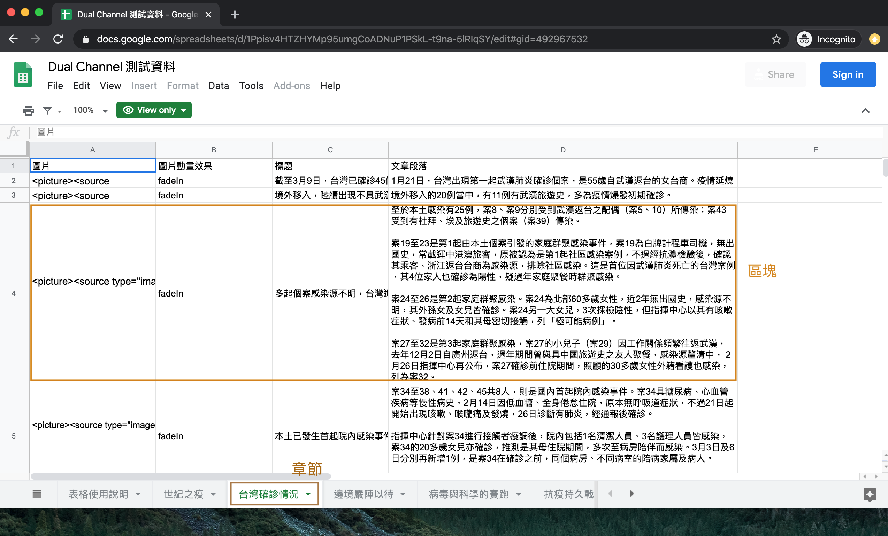
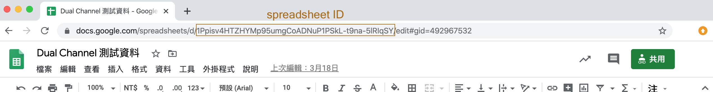
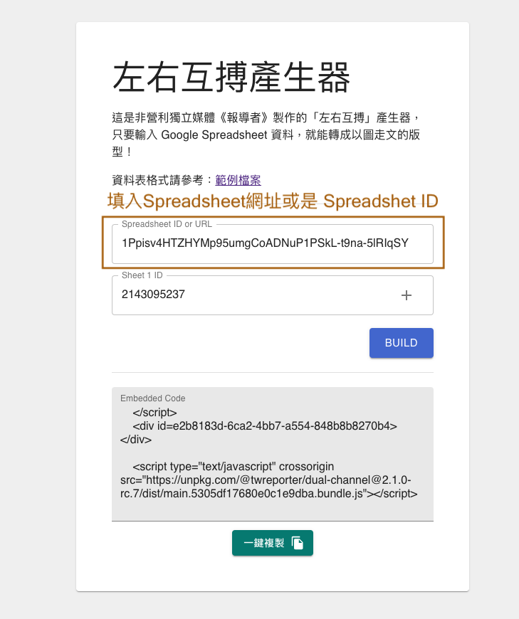

# 「報導者／左右互搏版型」—— 看圖說故事的網頁版型

## 前情提要

財團法人報導者文化基金會，以下簡稱「報導者」，為了提升使用者體驗，嘗試過不少以「圖」為主，以「文」為輔的說故事方式。包括：

- [到了 2018 年才 22K！曾經凍漲十年的基本工資](https://www.twreporter.org/i/min-wage-draft)
- [台灣勞工職業病圖譜－新興的風險與隱藏的黑數](https://www.twreporter.org/i/occupational-diseases-in-taiwan-gcs)
- [【圖解篇】被隱藏的醫療帳單：一年 600 億住院看護費誰該埋單？](https://www.twreporter.org/i/nursing-aide-crisis-of-taking-care-gcs)
- [網路聲量＝實際選票？24 張圖解密六都市長的網路聲量戰爭](https://www.twreporter.org/i/2018-election-report-sharevoice-gcs)
- [從武漢到世界 ──COVID-19（武漢肺炎）疫情即時脈動](https://www.twreporter.org/i/covid-2019-keep-tracking-gcs)

透過這些不同的嘗試，讓我們收斂出「報導者／左右互搏版型」（「左右互搏」取自金庸武俠小說中，周伯通自創的武功）

會取名「報導者／左右互搏版型」，是因為此版型，分左（放圖）右（放字）兩邊，圖和字的變化有不同邏輯，但卻牽動彼此。

[網路聲量](https://www.twreporter.org/i/2018-election-report-sharevoice-gcs) 和 [COVID-19 疫情即時脈動](https://www.twreporter.org/i/covid-2019-keep-tracking-gcs)兩篇即是使用「報導者／左右互搏版型」。

此版型主要針對桌機和手機載具設計。

在桌機版本，版型分成左右兩半，左邊走圖、右邊走文，在走文時，圖是固定在瀏覽器左側，讓讀者能夠同時讀文也讀圖。

在手機版本，版型分成上下兩區塊，上區塊走圖、下區塊走文，在走文時，圖固定佔據瀏覽器上方一半的位置，讓文走於其下，讀者亦能同時讀文也讀圖。此版型 m 主要是「以圖走文」，所以視覺重心的部位（瀏覽器左方和上方）皆是以圖為主。

## 起心動念

報導者從成立之初，就致力於「開放編輯室」、「開放原始碼」，將所做所學分享給大家，冀望以「取之於社會，用之於社會」的精神，在這漫漫長路上摸索前行。

程式碼開源至今也四年，一路累積下來，存放不少程式碼。然而，這些累積像是封存的網頁一般，擺在 GitHub 上，其大部分的意義，只是證明我們曾做過哪些題目，曾有過怎樣的企圖心的歷史痕跡而已。

對於非程式背景的人來說，我們開源的程式碼上手難度較高，因此，能具體幫助到的什麼，我們自己也說不準。

在報導者多次內部整修的過程中，我們聚焦出 2020 的目標，目標是**開發可重複使用，且將故事說得更好的網頁元件**。

而「報導者／左右互搏版型」便是其中之一的元件。此外，我們也推薦你試試看「[報導者／大事記](https://github.com/twreporter/orangutan-monorepo/blob/master/packages/timeline/docs/zh-tw/%E4%BD%BF%E7%94%A8%E8%AA%AA%E6%98%8E.md)」和「[報導者／橫著滾吧照片！](https://github.com/twreporter/orangutan-monorepo/blob/master/packages/scrollable-image/docs/zh-tw/manual.md)」。

## 使用方式

### 版型名詞介紹

在「報導者／左右互搏版型」中，將呈現資料分成「章節」和「區塊」。

如圖 1-1 所示，深咖啡色的方框是章節，淺咖啡色的方框則是區塊。

一個區塊擁有**一個標題**、**一張圖片**和**內文**。

一個章節則擁有**一個標題**和**數個區塊**。

舉「[從武漢到世界 ──COVID-19（武漢肺炎）疫情即時脈動](https://www.twreporter.org/i/covid-2019-keep-tracking-gcs)」這篇為例，總共有五個章節，分別為「世紀之疫」、「台灣確診情況」、「邊境嚴陣以待」、「病毒與科學的賽跑」和「抗疫持久戰」。

在每個章節裡，又分別有不同的區塊；以「台灣確診情況」章節來說，共有四個區塊，四個區塊總共呈現了四個標題、四張圖和四段文字。

在簡單說明版型後，我可以透過「章節」和「區塊」的概念來編寫 Spreadsheet。


_圖 1-1：深咖啡色的方框是章節，淺咖啡色的方框則是區塊。_

### 準備 Spreadsheet 串接資料

我們採用 Spreadsheet 來串接「報導者／左右互搏版型」的文、圖和動畫效果等資訊。

大家可以參考[「報導者／左右互搏版型」測試資料 - Google 試算表](https://docs.google.com/spreadsheets/d/1Ppisv4HTZHYMp95umgCoADNuP1PSkL-t9na-5lRIqSY/edit#gid=2143095237)。

「報導者／左右互搏版型」以**章節**和**區塊**來呈現資料，

- 章節對應到**工作表（sheet）**（見圖 1-2）
- 區塊則對應到工作表的**列（sheet row）** （見圖 1-2）
- 區塊（列）可以包含四個元素：圖片、圖片動畫效果（選填）、標題（選填）和文章段落。

簡單來說，「報導者／左右互搏版型」可以有多個章節（工作表），每個章節可以有多個區塊，每個區塊則由一張圖、一個小標和一段文字所組成。



_圖 1-2：章節對應到工作表，區塊對應到工作表中的一列。_

#### Spreadsheet 表格注意事項

1. **工作表的名稱即是章節標題的名稱**
2. **圖片動畫效果**欄：目前僅支援 **fadeIn** 和 **slideUp** 兩個效果（請注意英文字大小寫），若不想要有動畫效果，亦可在此欄留空不填。
3. **圖片**欄：目前僅支援 html code（若不清楚如何填寫，可以複製範本裡的 html code 來改，將圖片網址置換成你要的即可）。在下一版本，會讓使用者輸入手機圖片網址和桌機圖片網址，由系統自動產生響應式圖片。
4. **標題**欄：目前僅支援純文字。
5. **文章段落**欄：目前支援純文字，也支援 html code。舉例而言，我們可以在文中插入連結，寫法如下：

```
目前除了<a href="https://www.boca.gov.tw/cp-56-5078-41ac3-1.html">符合條件的旅客</a>外，中港澳人士全面暫緩入境；有中港澳旅遊史（含轉機）的人員若能入境台灣，需要接受14天的居家檢疫。
```

[符合條件的旅客](https://www.boca.gov.tw/cp-56-5078-41ac3-1.html) 在網頁上呈現時，會有超連結。

當 Spreadsheet 資料準備好後，即可進入下一個步驟：產生鑲嵌程式碼。

### 產生鑲嵌程式碼（Embed Code）

請根據以下步驟產生「鑲嵌程式碼」：

1. 瀏覽器開啟[「報導者／左右互搏版型」產生器](https://asia-east2-cloud-functions-268910.cloudfunctions.net/dual-channel)頁面
2. 在第一個欄位裡（見圖 1-4），填入你的 Spreadsheet 的網址或是 Spreadsheet ID（見圖 1-3）
3. 依序填入你想要出現在網頁上的工作表 ID（Sheet ID）（見圖 1-5）（註 1）
4. 若不填工作表 ID，程式會自動抓取 Spreadsheet 上**所有的章節**。
5. 點選 `BUILD` 按鈕
6. 稍等一下，頁面會產生出「鑲嵌程式碼」
7. 點選`一鍵複製`按鈕，即可將程式碼貼到你的網頁裡。



_圖 1-3 從網址中複製 Spreadsheet ID 。_



_圖 1-4 將 Spreadsheet 網址或是 Spreadsheet ID 填入第一個欄位中。_

＊註 1：點了 Spreadsheet 下方的工作表後（見圖 1-5），該 Spreadsheet 網址的最後會出現 `#gid=492967532`，`492967532`是該工作表的 ID，將此 ID 填入產生器中，即可產生該章節的內容。


_圖 1-5 先點工作表，接著複製該工作表的 ID 。_

### 製圖注意事項

#### 桌機版的圖

請以寬 415px，長 453px 的長方形來設計。

#### 手機版的圖

請以正方形來設計，例如：長 375px、寬 375px。

### 常見問題

#### 1. 我可以將圖片上傳到哪裡呢？

可以將圖片上傳到有提供圖片託管服務的網路空間，並取得圖片的公開網址。

下面是幾個推薦用來上傳圖片的平台以及操作指引：

- [Google 雲端硬碟](https://github.com/twreporter/orangutan-monorepo/tree/master/packages/scrollable-image/docs/zh-tw/google-drive-hosting.md)
- [Dropbox](https://github.com/twreporter/orangutan-monorepo/tree/master/packages/scrollable-image/docs/zh-tw/dropbox-hosting.md)
- imgur.com

#### 2. 若是我不熟 HTML 和 CSS，我該如何使用「報導者／左右互搏版型」？

現階段可以複製[「報導者／左右互搏版型」測試資料 - Google 試算表](https://docs.google.com/spreadsheets/d/1Ppisv4HTZHYMp95umgCoADNuP1PSkL-t9na-5lRIqSY/edit#gid=2143095237)來進行修改。
我們會根據使用者的回饋進行調整，希望之後的版本可以滿足你的需求，
為了進一步了解你的需求，請你給予我們回饋（請見下方[回饋](#回饋)）。

#### 3. 若是圖片的大小或是長寬比不同於放圖的區塊，導致圖的呈現有些扭曲或是圖沒有被完整呈現，我該怎麼辦？

由於我們在 Spreadsheet 中的**圖片**欄中，放入的值是 html code，因此可以透過 css 來調整。
舉例而言，若我的**圖片**欄中的值為

```html
<picture>
  <source
    type="image/svg+xml"
    media="(orientation: portrait)"
    srcset="https://www.twreporter.org/images/responsive/20200306072512-9fa12d4cc8.svg"
  />
  <source
    type="image/svg+xml"
    media="(orientation: landscape)"
    srcset="https://www.twreporter.org/images/responsive/20200306072512-f3dcc75cb7.svg"
  />
  
</picture>
```

那我可以在  標籤中，加入 `object-fit:contain` 的方式（註 2），讓圖等比例縮放至區塊裡；亦可以使用 `object-fit:cover` 的方式（註 2），讓圖撐滿區塊，但圖的周圍會被自動裁掉。
以上述範例來改，最後的結果會是，

```html
<picture>
  <source
    type="image/svg+xml"
    media="(orientation: portrait)"
    srcset="https://www.twreporter.org/images/responsive/20200306072512-9fa12d4cc8.svg"
  />
  <source
    type="image/svg+xml"
    media="(orientation: landscape)"
    srcset="https://www.twreporter.org/images/responsive/20200306072512-f3dcc75cb7.svg"
  />
  
</picture>
```

＊註 2：IE 不支援`object-fit`。

#### 4. 如果我用 infogram 產生圖（或圖表），我可以套用在「報導者／左右互搏版型」之中嗎？

Yes，你可以這麼做，你可以將 infogram 產生給你的鑲嵌程式碼，輸入在 Spreadsheet 的**圖片**欄裡，
如此一來，即可套用 infogram 在你的作品中。

#### 5.「報導者／左右互搏版型」 支援哪些瀏覽器？

我們主要用來開發瀏覽器是 Google Chrome，經過測試，在 Firefox、Safari、Internet Explorer (IE 10 以上，含 IE 10)、Edge 都能夠正常運作。

#### 6.「報導者／左右互搏版型」是否免費提供商業使用？

是，「報導者／左右互搏版型」使用 MIT 授權條款，可供商業使用且不需要支付任何費用，如您使用時能一併標明出處我們會非常感謝。
詳細資訊請見[授權條款頁](https://github.com/twreporter/orangutan-monorepo/blob/master/LICENSE)。

## 回饋

我們將程式碼公開放置於[Github](https://github.com/twreporter/orangutan-monorepo/tree/master/packages/dual-channel)，任何回饋或問題回報都歡迎直接在 Github 上開 Issue 或來信至 `developer@twreporter.org` 信箱，我們將有專人為你服務 :kissing_heart:。
