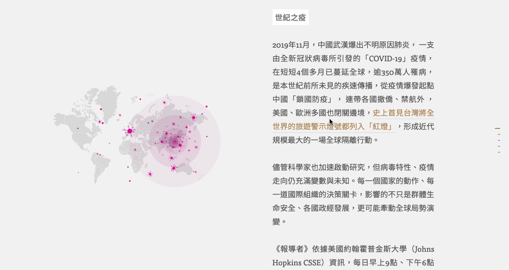
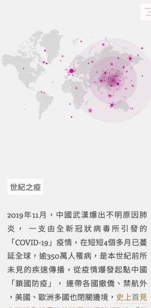
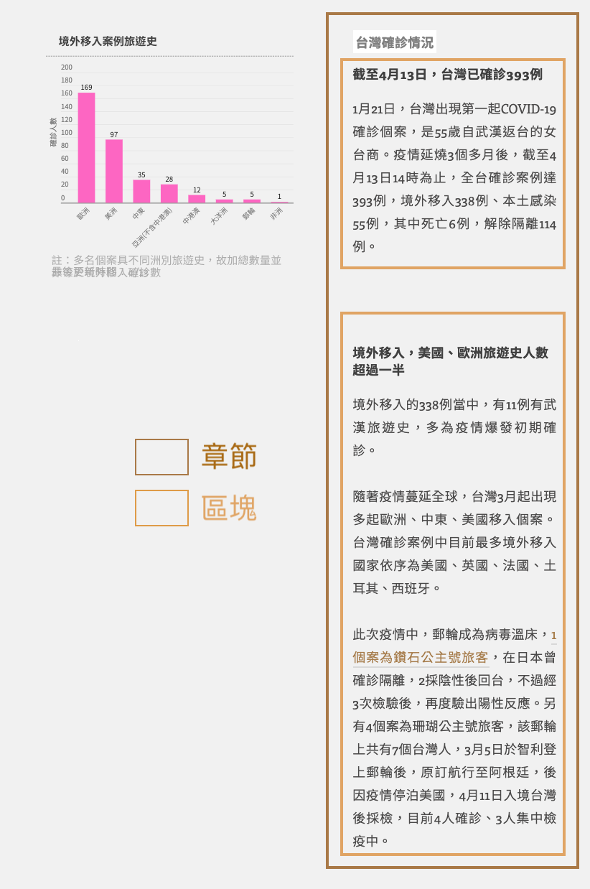
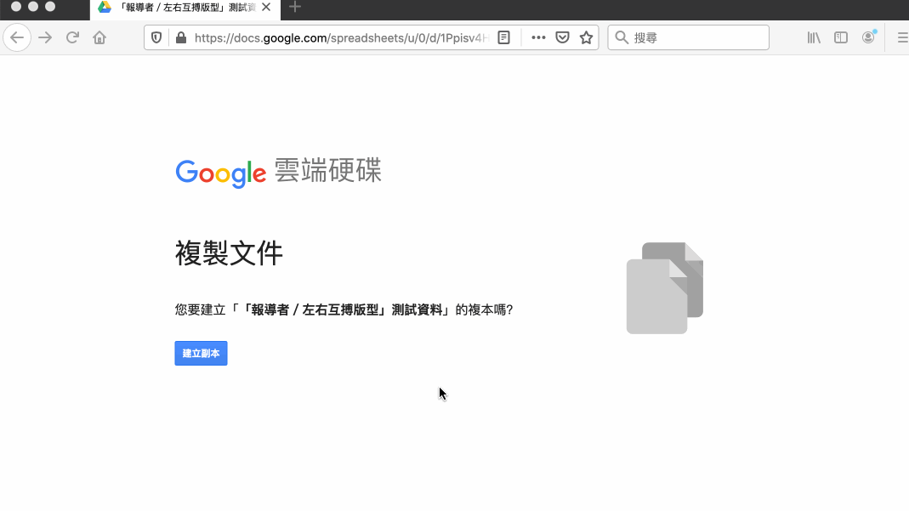
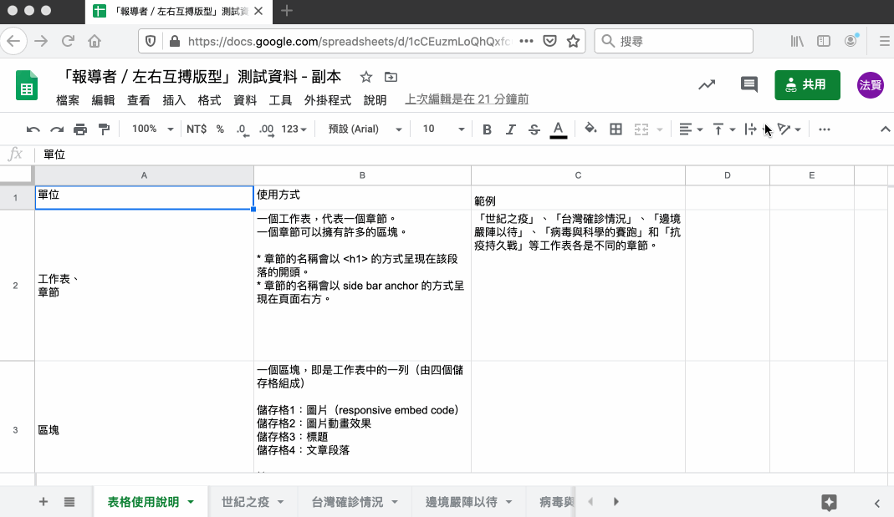
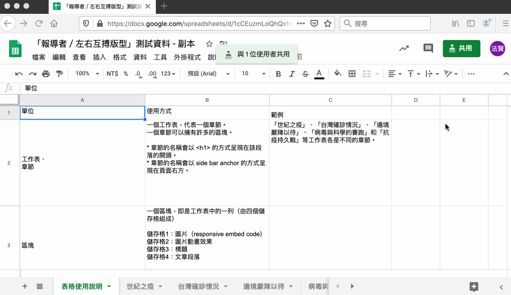
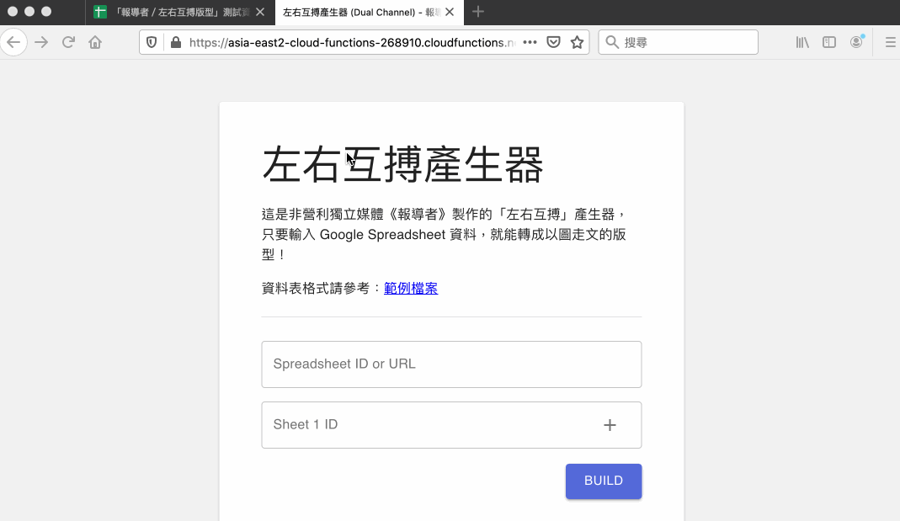
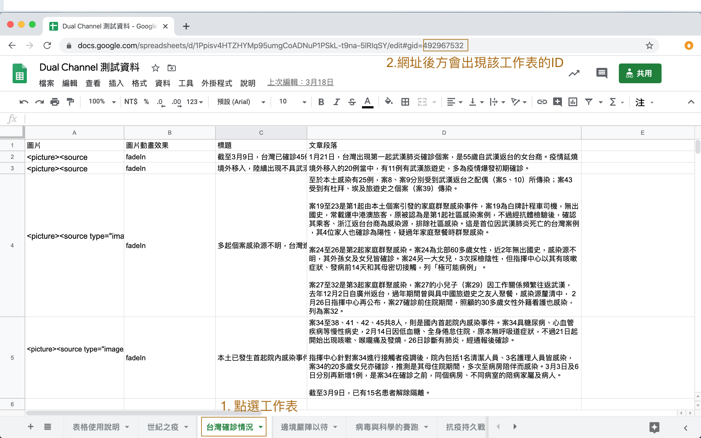

# 《報導者》新聞小工具上線公測 part III：左右互搏版型

**秉持深度、開放、非營利精神，《報導者》自創立以來，每個數位新聞專題作品的原始碼皆公開於 GitHub 平台供社會大眾自由使用，在一次次的數位敘事實驗與研究中，我們發現有些功能適合單獨取出、應用在個別報導中，因此著手開發易於使用的新聞小工具（網頁元件），並公開釋出技術，讓不會寫程式的使用者也能透過《報導者》開發的「產生器」取得直接置入網頁中的程式碼，不必額外撰寫程式碼。**

你的好故事可以有更多元的敘事選擇！「報導者開放實驗室」將陸續推出能夠「隨插即用」的網頁元件，有《報導者》過去經驗的再造，也不乏全新的敘事方法。

本文要介紹的元件「報導者／左右互搏版型」就是其中之一，接著會依序介紹使用步驟以及操作範例。

﹡相關程式採 MIT 授權條款，程式碼公開在我們的 GitHub 上。

---

## 看圖說故事的網頁版型

為了提升使用者體驗，報導者嘗試過不少以「圖」為主，以「文」為輔的說故事方式。包括：

- [到了 2018 年才 22K！曾經凍漲十年的基本工資](https://www.twreporter.org/i/min-wage-draft)
- [台灣勞工職業病圖譜－新興的風險與隱藏的黑數](https://www.twreporter.org/i/occupational-diseases-in-taiwan-gcs)
- [【圖解篇】被隱藏的醫療帳單：一年 600 億住院看護費誰該埋單？](https://www.twreporter.org/i/nursing-aide-crisis-of-taking-care-gcs)
- [網路聲量＝實際選票？24 張圖解密六都市長的網路聲量戰爭](https://www.twreporter.org/i/2018-election-report-sharevoice-gcs)
- [從武漢到世界 ──COVID-19（武漢肺炎）疫情即時脈動](https://www.twreporter.org/i/covid-2019-keep-tracking-gcs)

透過這些不同的嘗試，讓我們收斂出「報導者／左右互搏版型」（「左右互搏」取自金庸武俠小說中，周伯通自創的武功）。

會取名「報導者／左右互搏版型」，是因為此版型，分左（放圖）右（放字）兩邊，圖和字的變化有不同邏輯，但卻牽動彼此。

[網路聲量](https://www.twreporter.org/i/2018-election-report-sharevoice-gcs) 和 [COVID-19 疫情即時脈動](https://www.twreporter.org/i/covid-2019-keep-tracking-gcs)兩篇即是使用「報導者／左右互搏版型」。

此版型主要針對桌機和手機載具設計。

在桌機版本，版型分成左右兩半，左邊走圖、右邊走文，在走文時，圖是固定在瀏覽器左側，讓讀者能夠同時讀文也讀圖（見下圖 1.）。

**圖 1.：桌機版本，左側放圖，右側走文。**

在手機版本上，版型分成上下兩區塊，上區塊置圖、下區塊走文，在走文時，圖固定佔據瀏覽器上方一半的位置，讓文走於其下，讀者同時讀文讀圖（見下圖 2.）。此版型主要是「以圖走文」，所以視覺重心的部位（瀏覽器左方和上方）皆是以圖為主。

**圖 2.：手機版本，上方放圖，下方走文。**

## 使用教學

### 步驟 1. 版型名詞介紹

在「報導者／左右互搏版型」中，將呈現資料分成「章節」和「區塊」。

如圖 3. 所示，深咖啡色的方框是章節，淺咖啡色的方框則是區塊。

一個區塊擁有*一個標題*、*一張圖片*和*文章段落*。

一個章節則擁有*一個標題*和*數個區塊*。

舉從 [武漢到世界 ──COVID-19（武漢肺炎）疫情即時脈動](https://www.twreporter.org/i/covid-2019-keep-tracking-gcs) 這篇為例，總共有五個章節，分別為「世紀之疫」、「台灣確診情況」、「邊境嚴陣以待」、「病毒與科學的賽跑」和「抗疫持久戰」（註：由於該篇文章隨著疫情變化有所調整，現在點進去看，不一定是上述這五個章節）。

在每個章節裡，又分別有不同的區塊；以「台灣確診情況」章節來說，共有四個區塊，四個區塊總共呈現了四個標題、四張圖和四個文章段落。

在簡單說明版型後，我可以透過「章節」和「區塊」的概念來編寫試算表。

**圖 3. 章節與區塊說明**

### 步驟 2. 建立你的試算表

我們採用 Google 試算表來串接「報導者／左右互搏版型」的文、圖和動畫效果等資訊。

[點此建立範例試算表副本](https://docs.google.com/spreadsheets/d/1Ppisv4HTZHYMp95umgCoADNuP1PSkL-t9na-5lRIqSY/copy)（此為 Google Drive 連結，會將範例試算表複製到你的 Google 雲端硬碟）（見圖 4.）

**圖 4. 建立試算表副本**

### 步驟 3. 按照試算表上的格式說明，填入資料

注意在修改資料時，_不要改到試算表內的欄位順序_，也*不要改到有底色*的保護儲存格。

試算表與「報導者／左右互搏版型」的對應如下（見圖 5.）：

- 試算表的*工作表*（sheet）對應到*章節*
- 工作表的*一列*（row）對應到*一個區塊*
- 一列包含四個儲存格，依序是：圖片、圖片動畫效果（選填）、標題（選填）和文章段落。（注意：儲存格的順序不能更動。）

**圖 5. 章節對應到工作表，區塊對應到工作表中的一列**

#### 填寫儲存格時應注意事項：

1. 工作表名稱 = 章節名稱
2. _圖片動畫效果_：目前僅支援 _fadeIn_ 和 _slideUp_ 兩個效果（請注意英文字大小寫），若不想要有動畫效果，亦可在此欄留空不填。
3. _圖片_：目前僅支援 html code（若不清楚如何填寫，可以複製範本裡的 html code 來改，將圖片網址置換成你要的即可）。在下一版本，會讓使用者輸入手機圖片網址和桌機圖片網址，由系統自動產生響應式圖片。
4. _標題_：目前僅支援純文字，若該區塊不需要標題，可留空不填。
5. _文章段落_：目前支援純文字，也支援 html code。

### 步驟 4. 設定共用、授權「機器人」讀資料

編輯完資料，下一步就是產出可嵌入程式碼，但此之前得先讓報導者機器人知道這份試算表。

有兩種方式可授權機器人，第一種是在 _[共用]_ 設定中開啟與他人共用，無論是設為*「公開」*、_「知道連結的人均可檢視」_、*「知道連結的人均可編輯」*或*「知道連結的人均可評論」*，都能有效授權機器人，見圖 6.。

**圖 6. 設定試算表權限，讓機器人有權限讀取試算表。**

第 2 種情形是，若你不想開放共用，希望維持試算表只有特定授權使用者可以看到，請*記得輸入報導者機器人的 email，授權報導者機器人帳號讀取*：

`dual-channel@cloud-functions-268910.iam.gserviceaccount.com`

請注意，授權機器人帳號讀取時，要記得*將「通知邀請對象」打勾*，見圖 7.：

**圖 7. 輸入報導者機器人的 email ，授權機器人讀取試算表。**

### 步驟 5. 產生鑲嵌程式碼

請根據以下步驟產生「鑲嵌程式碼」：

1. 點此打開「報導者／左右互搏版型」產生器頁面
2. 在第一個欄位中，填入你的試算表網址
3. 依序填入你想要出現在網頁上的工作表 ID（註 1）
4. 若不填工作表 ID，程式會自動抓取試算表上所有的章節。
5. 點 `Build` 按鈕
6. 稍等一下，頁面會產生出「鑲嵌程式碼」
7. 點選 `一鍵複製` 按鈕，即可將程式碼貼到你的網頁裡。

**圖 8. 用產生器產生鑲嵌程式碼。**

註 1：點了試算表下方的工作表後（見圖 9.），該網址的最後會出現`#gid=492967532`， `492967532`是該工作表的 ID，將此 ID 填入產生器中，即可產生該章節的內容。

**圖 9. 點選工作表，查看該工作表 ID。**

### 步驟 6. 複製程式碼片段（embedded code），貼至目標網頁的 HTML 中你想要顯示的位置。

---

## 注意事項

由於「報導者／左右互搏版型」是以圖為主，因此，請各位在製圖時，參照以下格式製圖。

### 桌機版的圖

請以寬 415px，長 453px 的長方形來設計。

### 手機版的圖

請以長 375px、寬 375px 的正方形來設計。

## 常見問題

### 1. 我可以將圖片上傳到哪裡呢？

可以將圖片上傳到有提供圖片託管服務的網路空間，並取得圖片的公開網址。

下面是幾個推薦用來上傳圖片的平台以及操作指引：

- [Google 雲端硬碟](https://github.com/twreporter/orangutan-monorepo/blob/master/packages/scrollable-image/docs/zh-tw/google-drive-hosting.md)
- [Dropbox](https://github.com/twreporter/orangutan-monorepo/blob/master/packages/scrollable-image/docs/zh-tw/dropbox-hosting.md)
- imgur.com

### 2. 若是我不熟 HTML 和 CSS，我該如何使用「報導者／左右互搏版型」？

現階段可以複製「報導者／左右互搏版型」測試資料  - Google 試算表來進行修改。

我們會根據使用者的回饋進行調整，希望之後的版本可以滿足你的需求，
為了進一步了解你的需求，請各位給予我們回饋。

回饋表單：https://forms.gle/qaKvMD2Ar2X4H2x37。

### 3. 如果我用 Infogram 產生圖（或圖表），我可以套用在「報導者／左右互搏版型」之中嗎？

Yes，你可以這麼做，你可以將 [Infogram](https://infogram.com/) 產生給你的鑲嵌程式碼，輸入在試算表的圖片儲存格裡，
如此一來，即可套用 Infogram 在你的作品中。

### 5.「報導者／左右互搏版型」是否免費提供商業使用？

是，「報導者／左右互搏版型」使用 MIT 授權條款，可供商業使用且不需要支付任何費用，如您使用時能一併標明出處我們會非常感謝。

詳細授權資訊請見[MIT 授權條款頁](https://github.com/twreporter/orangutan-monorepo/blob/master/LICENSE)。

## 給點意見回饋吧！

如果覺得小工具很實用，請給我們拍拍手 👏，鼓勵一下~
如果使用後有疑問，您可以透過以下任何管道給我們回饋意見：

1. 填寫「報導者／左右互搏版型」回饋表單：https://forms.gle/qaKvMD2Ar2X4H2x37
2. 在《報導者》的 [GitHub](https://github.com/twreporter/orangutan-monorepo/tree/master/packages/dual-channel) 上開 issue 或 open PR
3. 來信至報導者工程部信箱 developer@twreporter.org，我們將有專人為你服務 😘。

## ABOUT 報導者開放實驗室 The Reporter Lab

[「報導者開放實驗室」](https://medium.com/twreporter)的任務之一，是提供開源的數位敘事小工具，增加說故事的方式，並且幫助減少資訊產製過程中不必要的重複工作，讓內容生產者能專注在生產優質的內容。

「報導者／左右互搏版型！」是我們所製作的各種小工具其中之一，若您對更多數位敘事及新聞幕後有興趣，歡迎追蹤我們的頁面：

👉[報導者開放實驗室 The Reporter Lab](https://medium.com/twreporter)

---
