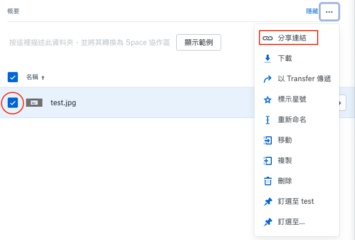
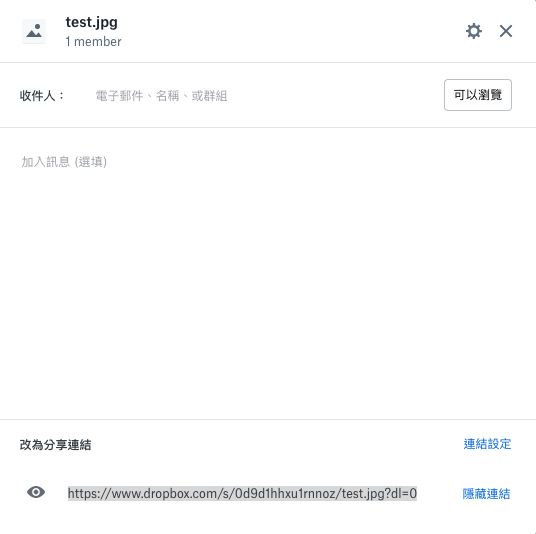

# 使用 Dropbox 託管圖片

## 步驟

### 步驟 1：將圖片上傳至 Dropbox

### 步驟 2：取得檔案分享連結

勾選檔案，點擊分享連結

在跳出的對話框中點選複製連結，此時瀏覽連結已複製

### 步驟 3：依照範例修改分享網址

前一步驟所複製的瀏覽連結應該會像這樣：

`https://www.dropbox.com/s/xxxxxx/xxxxxx.xxx?dl=0`

把 `www.dropbox.com` 改成 `dl.dropboxusercontent.com`：

`https://dl.dropboxusercontent.com/s/xxxxxx/xxxxxx.xxx?dl=0`

這個連結就是我們要使用的圖片公開網址了。
