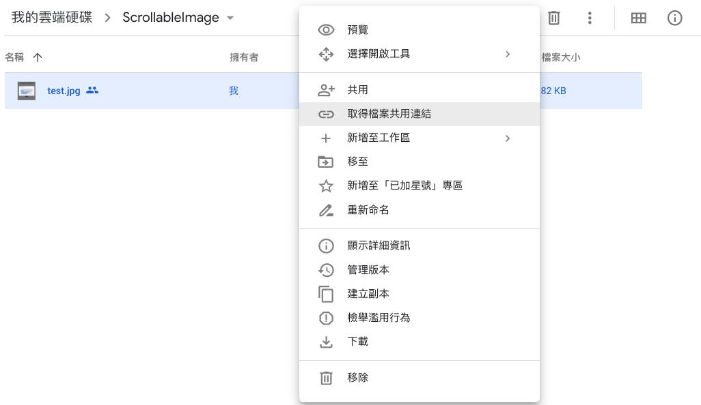
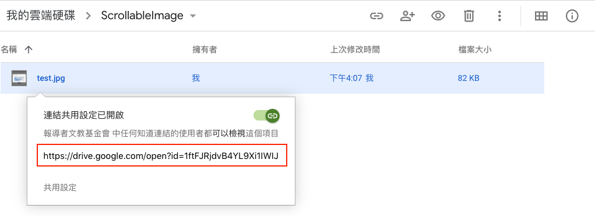

# 使用 Google Drive 託管圖片

## 步驟

### 步驟 1：將圖片上傳至 Google Drive

### 步驟 2：在該圖片上按右鍵，取得檔案共用連結

### 步驟 3：開啟連結共用設定，並複製紅框框內的分享網址

### 步驟 4：依照範例修改分享網址

步驟 3 複製的分享網址應該會像這樣：

`https://drive.google.com/open?id=xxxxxxx`

把 `open` 改成 `uc`：

`https://drive.google.com/uc?id=xxxxxxx`

這個連結就是我們要使用的圖片公開網址了。
