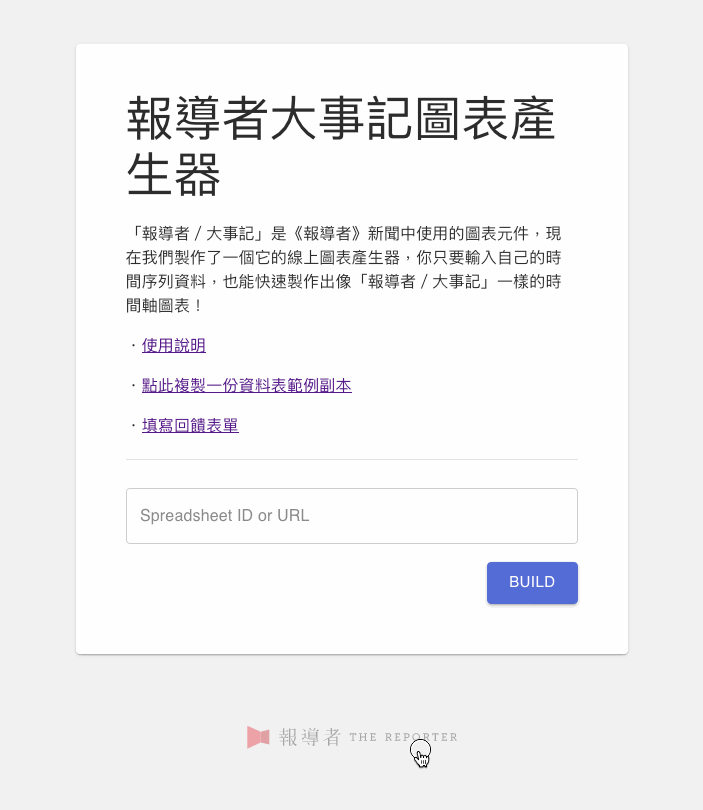
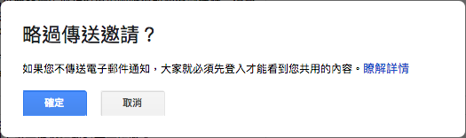
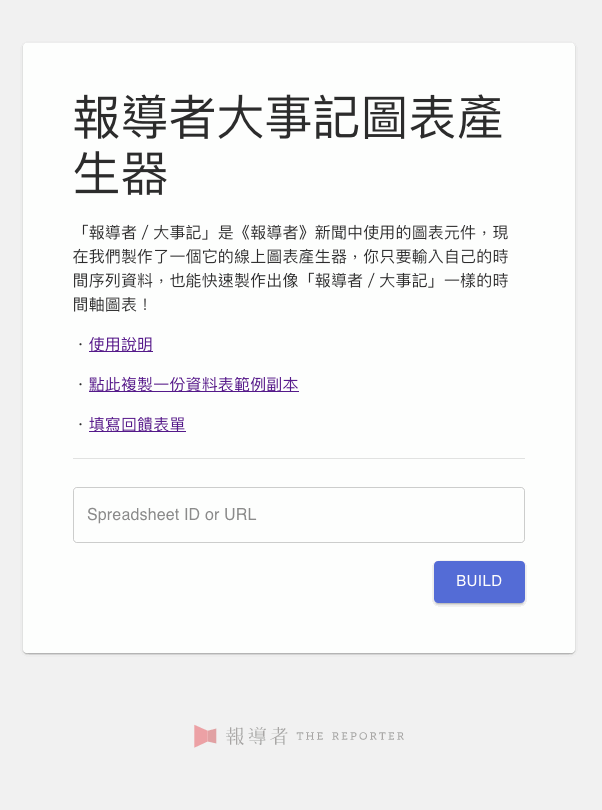
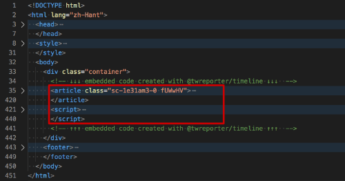

# 「報導者／滾動式影片」產生器使用說明－－《報導者開放實驗室 The Reporter Lab》

「報導者開放實驗室」的「新聞敘事元件庫」再釋出一個新的元件囉！這次推出的是「滾動式影片」，請看 DEMO：

[DEMO]() <!-- TODO: Add demo -->

不管是動畫、照片、插畫、圖表、錄影，只要把它剪輯成影片，就可以讓讀者一邊看影片，一邊閱讀提示文字。

和一般影片的差別是，滾動式影片不會自動播放，而是在透過讀者滑動頁面的動作逐格步進，更接近使用觸控式載具的閱讀體驗。

這個形式相當適合  影像和文字並行的內容，不管是要讓讀者感受文字無法表現的氣氛和脈絡，或是要讓讀者搭配文字仔細閱讀影像中的細節，都可以使用。

## 使用說明

### 前置作業

首先，你要先製作好你的影片檔案，將它們上傳到網頁空間，取得影片連結。

「報導者／滾動式影片」產生器沒有綁定任何影片格式、編碼、長度、尺寸、檔案大小等，但你在製作影片時，仍然需要考量你所選擇的這些規格，是否能讓各種載具的讀者，都能夠在載入網頁時順利播放。

如果你不清楚如何選擇影片檔案格式和編碼，可以參考 [MDN: Web Video Codec Guide](https://developer.mozilla.org/en-US/docs/Web/Media/Formats/Video_codecs#Choosing_a_video_codec) 的建議，選擇最通用的 `video/webm` (with `VP8` video codec) 和 `video/mp4` (with `AVC (H.264)` video codec)。

「報導者／滾動式影片」支援設定多種格式的影片連結，當你在 `video.sources` 中指定多個影片檔案時，讀者的瀏覽器會依序選擇下載第一個它所支援的格式。

此外，「報導者／滾動式影片」也支援讓不同大小的載具會使用不同影片的功能。所以你可以分別製作檔案較小、垂直畫面的手機版影片，以及檔案較大、水平畫面的桌機版影片。只要在資料表中設定螢幕寬度在某個數值以下時使用手機版影片即可（詳見以下建立試算表說明）。

### 步驟 1. 建立你的滾動式影片資料試算表

首先要建立一個符合產生器資料格式的 Google 表單。

 <!-- TODO: update screenshot with production spreadsheet -->

[點此觀看範例試算表內容](https://docs.google.com/spreadsheets/d/1NGkxS5BsnabmnC5y7k3p8IjwYdmz4TRo1J1TdprsPfg/)

可以 [點此快速建立範例試算表副本](https://docs.google.com/spreadsheets/d/1NGkxS5BsnabmnC5y7k3p8IjwYdmz4TRo1J1TdprsPfg/copy)（此為 Google Drive 連結，會將範例試算表複製到你的 Google Drive）。

 <!-- TODO: update screenshot with production spreadsheet -->

### 步驟 2. 按照試算表上的格式說明，填入你的資料

將影片連結、字幕內容、樣式設定等填入資料表。

範例資料表中有每個欄位的詳細說明。另外，教學後面的部分有範例解釋字幕位置如何設定。

請注意在修改資料時，不要改到試算表內的欄位順序，也**不要改到有底色的保護儲存格**。

### 步驟 3. 設定共用、授權「機器人」讀資料

編輯完資料，下一步就是產出可嵌入程式碼，但此之前得先讓報導者機器人知道這份試算表。

有兩種方式可授權機器人，第一種是在 [共用] 設定中開啟與他人共用，無論是設為 **「公開」**、**「知道連結的人均可檢視」**、**「知道連結的人均可編輯」** 或 **「知道連結的人均可評論」**，都能有效授權機器人。

 <!-- TODO: update screenshot with production naming -->

第 2 種情形是，若你不想開放共用，希望維持試算表只有特定授權使用者可以看到，請記得輸入報導者機器人的 email，授權報導者機器人帳號讀取： `scrollable-video@cloud-functions-268910.iam.gserviceaccount.com`

⚠️ 請注意，授權機器人帳號讀取時，要記得將「通知邀請對象」打勾：

 <!-- TODO: update screenshot with production naming -->

如果沒有勾選通知，會跳出警告，因為機器人帳號和一般帳號不同，沒有辦法作登入動作，若略過傳送邀請，將會無法給予權限。

因為機器人帳號和一般帳號不同，沒有辦法作登入動作，若略過傳送邀請，將會無法給予權限

### 步驟 4. 打開「大事記圖表產生器」、產生鑲嵌程式碼

[大事記圖表產生器](https://lab.twreporter.org/projects/scrollable-video)

 <!-- TODO: update screenshot with production naming -->

### 步驟 5. 複製鑲嵌程式碼，貼至目標網頁的 HTML 中你想要顯示的位置

將複製的 embedded code 貼到你想要的網頁位置

 <!-- TODO: update screenshot with production code -->

[原始碼範例](../assets/example.html) <!-- TODO: add example with production code -->

## 字幕位置說明

## 設定字幕出現位置

在使用「報導者／滾動式影片」產生器時，可以透過更改資料表中的資料，自訂字幕出現在螢幕中的位置。

首先在「captions」資料表裡面，可以透過 `time` 值設定每個字幕移動到畫面上的「指定位置」時，對應到的影片的秒數。秒數可以指定到小數點後一位。：

而這個在字幕在指定時間會移動到的「指定位置」，可以透過「appProps」資料表裡的各項 `captionsSetting` 值進行設定。

`xBoxAlign` 、 `yBoxAlign` 設定字幕位置起算的起點， `xPosition` 、 `yPosition` 設定從起點出發位移多少。

如以下範例所展示：

在「appProps」中設定的位置會套用到**所有的**字幕上。

如果想要改變特定某個字幕的位置，可以在「captions」資料表中對該字幕的 `xBoxAlign` 、 `yBoxAlign` 、 `xPosition` 、 `yPosition` 設定值，就會直接覆蓋掉該字幕原本「appProps」的設定。

如果是想要對特定字幕作微調，並且是相對於「appProps」中設定的位置作位移，則可以用「captions」資料表中該字幕的 `xOffset` 、 `yOffset` 進行調整。範例如下所示：

## 自訂樣式和版面

在資料表中修改 `[theme]` 的值，就可以自訂樣式

## 使用案例

### 《報導者》

<!-- TODO: Add demo -->

如有其他作品使用，歡迎來信 `developer@twreporter.org` 分享

## 常見問題

### 1.「報導者／滾動式影片」的圖表程式碼，支援哪些瀏覽器？

在各主要瀏覽器如 Firefox、Google Chrome、Safari 都能夠正常運作。（Internet Explorer、Edge 尚在測試中）

程式碼採用響應式設計，會自動根據螢幕寬度調整適合的版面。

如有遇到瀏覽器顯示結果異常，請填寫[回報表單](https://forms.gle/TidE4vNBzsPWECXDA)。或將您的異常狀況、作業系統、瀏覽器名稱、瀏覽器版本等資訊傳送到 `developer@twreporter.org`。

### 2. 「報導者／滾動式影片」是否提供商業使用？

使用「報導者／滾動式影片」產生的程式碼中會使用 GreenSocks 公司的 ScrollTrigger 產品，若您要程式碼用作商業使用，需遵守 GreenSocks 公司的授權規定。（詳請見：[https://greensock.com/licensing/](https://greensock.com/licensing/)）

除了上述部分以外，「報導者／滾動式影片」程式是採 MIT 授權條款，可供免費商業使用。如您使用時能一併標明出處，我們會非常感謝。

詳細 MIT 授權條款資訊請見[授權條款頁](https://github.com/twreporter/orangutan-monorepo/blob/master/LICENSE)。

## 意見回饋

您可以透過以下任何管道給我們回饋意見：

1. 填寫[回饋表單](https://forms.gle/TidE4vNBzsPWECXDA)
2. 在我們的 [Github](https://github.com/twreporter/orangutan-monorepo/tree/master/packages/timeline) 上開 issue 或 open PR
3. 來信至報導者工程部信箱 `developer@twreporter.org` ，我們將有專人為你服務 :kissing_heart:。

## 報導者開放實驗室

[「報導者開放實驗室」](https://medium.com/twreporter)的任務之一，是提供開源的新聞小工具，增加說故事可能的方式，減少產製過程中不必要的重複工作，與內容生產者一起製作更多優質的報導。

「報導者／滾動式影片」產生器是我們所製作的各種新聞小工具其中之一，若您對更多新聞小工具有興趣，歡迎追蹤我們的頁面：[報導者開放實驗室 The Reporter Lab](https://medium.com/twreporter)
