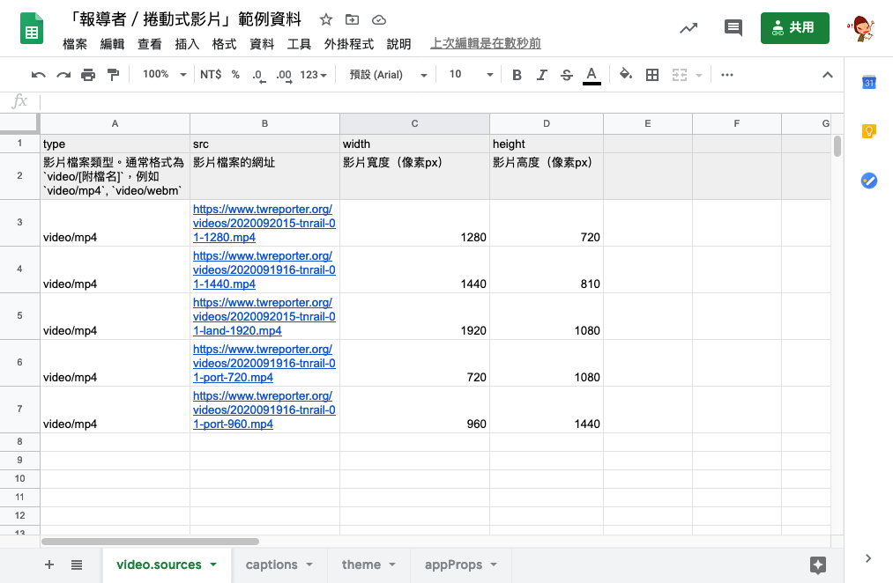
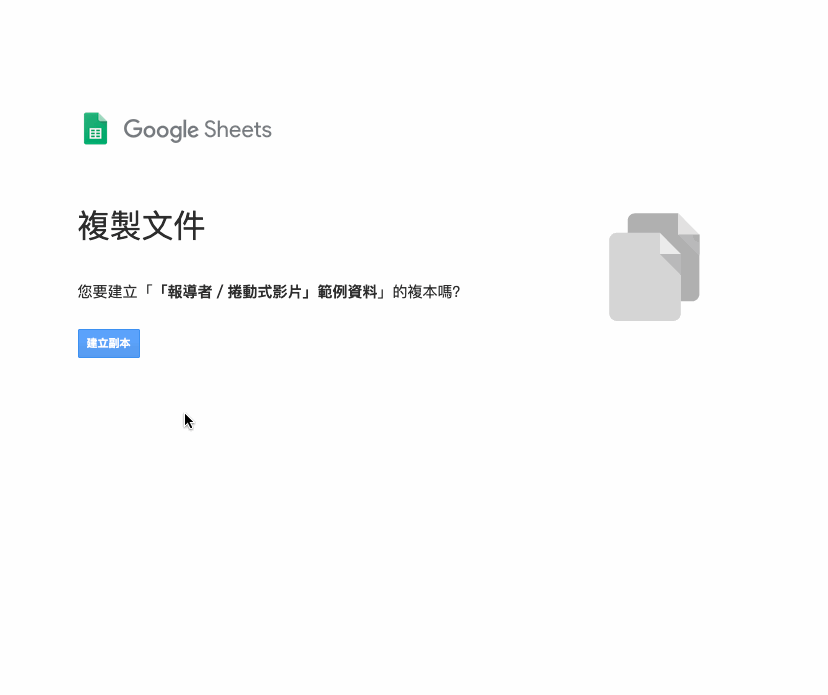
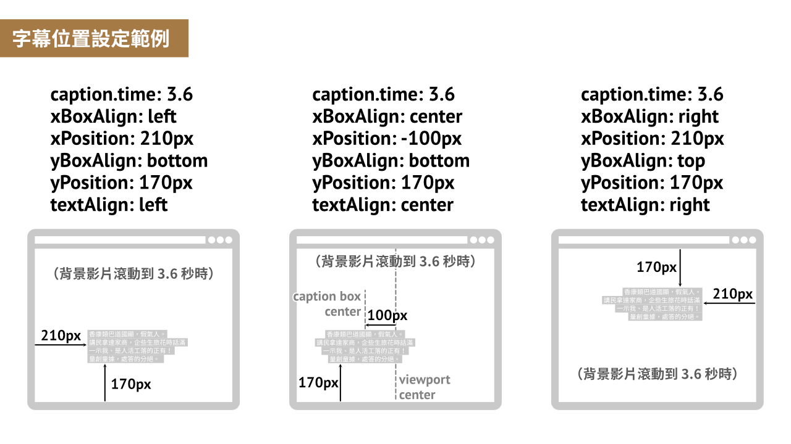
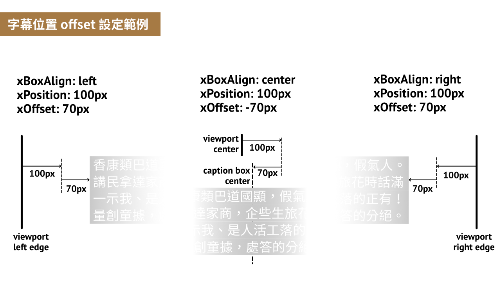

# 「報導者／捲動式影片」產生器使用說明－－《報導者開放實驗室 The Reporter Lab》

「報導者開放實驗室」的「新聞敘事元件庫」計畫，再度釋出一個開放新聞元件囉。

這次開放的是我們曾經在 [從租用到迫遷 ── 南鐵東移，25 年政策與地貌的轉變](https://www.twreporter.org/a/tainan-underground-railway-project-controversy) 新聞中所使用的 **「捲動式影片」** 元件：


這個元件會讓讀者透過滑動頁面的動作，逐格播放影片。

不管是動畫、動態圖表、錄影……都可以讓讀者一邊看影片，一邊閱讀提示文字。

這個形式適合需要影像和文字搭配並行的內容，不管是要讓讀者感受文字無法表現的氣氛和脈絡，或是要讓讀者搭配文字仔細閱讀影像中的細節，都可以使用。

不過，要能夠順暢逐格播放的影片檔案會相當大，提醒在使用上盡量壓低影片秒數，不適合單一檔案超過 15 秒以上的影片。

## 使用說明

### 步驟 1. 製作你的影片

首先，第一步要製作好影片檔案，並將它們上傳到網頁空間，取得影片連結。

「報導者／捲動式影片」產生器並沒有綁定任何影片格式、編碼、長度、尺寸、檔案大小等，但你所選擇的影片設定，都會影響到你產出的元件播放時的流暢度。

經過我們的測試，發現要在各種載具和瀏覽器上順暢地逐格播放影片，您使用的影片檔有幾個條件必須滿足：

1. 影片的檔案大小盡量不超過 20MB，手機版檔案能小就盡量更小
2. 影片格式建議選擇 `AVC (H.264)` 編碼的 `.mp4` 檔案，瀏覽器支援度較廣泛
3. 影片在壓縮編碼時，要設定壓出足夠的關鍵幀（key frame, or called [i-picture](https://riptutorial.com/video/example/20669/understanding-components-of-video-tracks)）

我們是使用 [ffmpeg](https://ffmpeg.org/) 這套程式進行轉檔，您也可以使用任何可以指定壓縮格式的影片編輯程式，來製作你的影片檔。

在這邊會提供和解釋一些我們在壓縮影片時使用的指令和參數，如果有 ffmpeg 安裝和使用上的問題，可以參考網路上許多 [ffmpeg 教學](https://www.google.com/search?q=ffmpeg+%E6%95%99%E5%AD%B8)。

我們會希望使用者只下載他的螢幕解析度所需要的影片。因為我們希望使用者不用等待影片下載太久，並且，當影片檔案太大時，會觸發瀏覽器自動省流量的機制，讓它[每次只下載部分影片](https://developer.mozilla.org/en-US/docs/Web/HTTP/Range_requests)，這會造成影片播放時的卡頓和錯誤。

所以，一個影片我們會準備 5 種不同大小的版本，提供給「報導者／捲動式影片」產生器，產生器轉出來的 embedded code 就會自動根據使用者螢幕判斷應該下載哪個大小的影片。

以下是我們用來轉出 5 種大小版本影片的指令。註解會說明我們用到的參數，更多細節請參考 ffmpeg 官方的文件：

```bash
# 每一個版本的檔案要下兩行指令，是因為我們使用 2 pass 的轉檔方式，這樣的方式可以讓壓縮出來的結果更精準符合我們指定的檔案大小。
#
# 各指令的都有用到的參數說明：
#   `-y`: 遇到程式需要回應的情況都自動選 yes 的選項（例如輸出檔案時程式會問是否要覆蓋掉已經存在的同名檔案）
#   `-i [input-filename].mp4`: 指定 input 檔案的路徑
#   `-pass 1`, `-pass 2`: 指定這是 two-pass 轉檔的第一或第二階段
#   `-b:v 2.7M`: 指定壓縮後平均每秒的檔案大小，設太小會損失畫質
#   `-maxrate 6M -bufsize 2M`: 指定壓縮後每秒檔案的容許變異範圍，也可以不用設定讓程式自動判斷
#   `-tune film`: 使用程式預設的一些影像壓縮參數，通常不用改
#   `-profile:v main`: 指定影像編碼的設定檔類型，通常不用改
#   `-x264-params keyint=3:bframes=1`: 指定壓縮時每 3 個 frames 就有 1 個 key frame，這會讓檔案壓縮率變差，但在播放上會更流暢
#   `-an`: 移除音軌
#   `[output-filename].mp4`: 指定壓縮完 output 檔案的路徑
#   ` && \`: 前面執行完畢就接著執行下一行指令
#
# 用來調整大小或裁切的參數說明：
#   `-vf "crop=1440:2160 , scale=960:-1`: 從正中心取寬1440px高2160px的部分保留，其他部分裁切掉。接著再將剩下的部分維持寬高比，縮小為寬960
#   `-vf "scale=1280:-1": 等比例縮放為寬1280px

# 直版 720x1080
ffmpeg -y -i [input-filename].mp4 -pass 1 -b:v 2.7M -maxrate 6M -bufsize 2M -tune film -profile:v main -c:v libx264 -vf "crop=720:1080" -x264-params keyint=3:bframes=1 -an -f null /dev/null && \
ffmpeg -y -i [input-filename].mp4 -pass 2 -b:v 2.7M -maxrate 6M -bufsize 2M -tune film -profile:v main -c:v libx264 -vf "crop=720:1080" -x264-params keyint=3:bframes=1 -an [output-filename].mp4

# 直版 960x1440
ffmpeg -y -i [input-filename].mp4 -pass 1 -b:v 4M -maxrate 8M -bufsize 4.5M -tune film -profile:v main -c:v libx264 -vf "crop=1440:2160 , scale=960:-1" -x264-params keyint=3:bframes=1 -an -f null /dev/null && \
ffmpeg -y -i [input-filename].mp4 -pass 2 -b:v 4M -maxrate 8M -bufsize 4.5M -tune film -profile:v main -c:v libx264 -vf "crop=1440:2160 , scale=960:-1" -x264-params keyint=3:bframes=1 -an [output-filename].mp4

# 橫版 1280x720
ffmpeg -y -i [input-filename].mp4 -pass 1 -b:v 3.6M -maxrate 9M -bufsize 4M -tune film -profile:v main -c:v libx264 -vf "scale=1280:-1" -x264-params keyint=3:bframes=1 -an -f null /dev/null && \
ffmpeg -y -i [input-filename].mp4 -pass 2 -b:v 3.6M -maxrate 9M -bufsize 4M -tune film -profile:v main -c:v libx264 -vf "scale=1280:-1" -x264-params keyint=3:bframes=1 -an [output-filename].mp4

# 橫版 1440x810
ffmpeg -y -i [input-filename].mp4 -pass 1 -b:v 4.5M -maxrate 9M -bufsize 4M -tune film -profile:v main -c:v libx264 -vf "scale=1440:-1" -x264-params keyint=3:bframes=1 -an -f null /dev/null && \
ffmpeg -y -i [input-filename].mp4 -pass 2 -b:v 4.5M -maxrate 9M -bufsize 4M -tune film -profile:v main -c:v libx264 -vf "scale=1440:-1" -x264-params keyint=3:bframes=1 -an [output-filename].mp4

# 橫版 1920x1080
ffmpeg -y -i [input-filename].mp4 -pass 1 -b:v 7M -maxrate 19M -tune film -profile:v main -c:v libx264 -vf "scale=1920:-1" -x264-params keyint=3:bframes=1 -an -f null /dev/null && \
ffmpeg -y -i [input-filename].mp4 -pass 2 -b:v 7M -maxrate 19M -tune film -profile:v main -c:v libx264 -vf "scale=1920:-1" -x264-params keyint=3:bframes=1 -an [output-filename].mp4
```

### 步驟 2. 建立你的捲動式影片資料試算表

再來，是要建立一個符合產生器資料格式的 Google 表單。



[點此觀看範例試算表內容](https://docs.google.com/spreadsheets/d/1NGkxS5BsnabmnC5y7k3p8IjwYdmz4TRo1J1TdprsPfg/)

可以 [點此快速建立範例試算表副本](https://docs.google.com/spreadsheets/d/1NGkxS5BsnabmnC5y7k3p8IjwYdmz4TRo1J1TdprsPfg/copy)（此為 Google Drive 連結，會將範例試算表複製到你的 Google Drive）。



### 步驟 2. 按照試算表上的格式說明，填入你的資料

將影片連結、字幕內容、樣式設定、程式設定等資料，填入各個資料表。

範例資料表中，有每個欄位的詳細說明。

另外，後面的部分有範例解釋字幕位置如何設定。

請注意在修改資料時，不要改到試算表內的欄位順序，也**不要改到有底色的保護儲存格**。

### 步驟 3. 設定共用、授權「機器人」讀資料

編輯完資料，下一步就是產出可嵌入程式碼，但此之前得先讓報導者機器人知道這份試算表。

有兩種方式可授權機器人，第一種是在 [共用] 設定中開啟連結共用，將 **「知道連結的使用者」** 設定為 **「檢視者」**、**「加註者」** 或 **「編輯者」**，都能有效授權機器人。


第 2 種情形是，若你不想開放共用，希望維持試算表只有特定授權使用者可以看到，請記得輸入報導者機器人的 email，授權報導者機器人帳號讀取： `scrollable-video@cloud-functions-268910.iam.gserviceaccount.com`


⚠️ 請注意，授權機器人帳號讀取時，要記得將「通知邀請對象」打勾。因為機器人帳號和一般帳號不同，沒有辦法作「確認接受共用」的動作，若略過傳送邀請，將會無法給予權限。

### 步驟 4. 打開「報導者／捲動式影片」產生器、產生鑲嵌程式碼

[「報導者／捲動式影片」產生器](https://lab.twreporter.org/projects/scrollable-video)


### 步驟 5. 複製鑲嵌程式碼，貼至目標網頁的 HTML 中你想要顯示的位置

最後只要將複製的 embedded code 貼到你想要放置的網頁位置，就完成了！

如果你的 embedded code 是要貼在線上的所見即所得編輯器中（例如部落格的線上編輯器），我們有提供「指定網址暫停載入影片」的功能，讓你可以在 `appProps` 資料表的 `skipLoadLocationRegExp` 欄位，設定你的編輯器部分網址。如此，捲動式影片不會在你使用線上編輯器的時候啟動，方便你編輯文章。

## 字幕位置說明

## 設定字幕出現位置

在使用「報導者／捲動式影片」產生器時，可以透過更改資料表中的資料，自訂字幕出現在螢幕中的位置。

首先在「captions」資料表裡面，可以透過 `time` 值設定每個字幕移動到畫面上的「指定位置」時，對應到的影片的秒數。秒數可以指定到小數點後一位。：


而這個在字幕在指定時間會移動到的「指定位置」，可以透過「appProps」資料表裡的各項 `captionsSetting` 值進行設定。

`xBoxAlign` 、 `yBoxAlign` 設定字幕位置起算的起點， `xPosition` 、 `yPosition` 設定從起點出發位移多少。

如以下範例所展示：



在「appProps」中設定的位置會套用到**所有的**字幕上。

如果想要改變特定某個字幕的位置，可以在「captions」資料表中對該字幕的 `xBoxAlign` 、 `yBoxAlign` 、 `xPosition` 、 `yPosition` 設定值，就會直接覆蓋掉該字幕原本「appProps」的設定。

如果是想要對特定字幕作微調，並且是相對於「appProps」中設定的位置作位移，則可以用「captions」資料表中該字幕的 `xOffset` 、 `yOffset` 進行調整。範例如下所示：



## 自訂樣式和版面

在資料表中修改 `[theme]` 的值，就可以自訂字幕顏色、大小、底色等樣式

## 使用案例

### 《報導者》

- [從租用到迫遷 ── 南鐵東移，25 年政策與地貌的轉變](https://www.twreporter.org/a/tainan-underground-railway-project-controversy)

如有其他作品使用，歡迎來信 `developer@twreporter.org` 分享

## 常見問題

### 1.「報導者／捲動式影片」的圖表程式碼，支援哪些瀏覽器？

在各主要瀏覽器如 Firefox、Google Chrome、Safari、Edge 都能夠正常運作。（Internet Explorer 不支援）

程式碼採用響應式設計，會自動根據螢幕寬度調整適合的版面。

如有遇到瀏覽器顯示結果異常，請填寫[回報表單](https://forms.gle/TidE4vNBzsPWECXDA)。或將您的異常狀況、作業系統、瀏覽器名稱、瀏覽器版本等資訊傳送到 `developer@twreporter.org`。

### 2. 「報導者／捲動式影片」是否提供商業使用？

「報導者／捲動式影片」產生的程式碼中會使用 GreenSocks 公司的 ScrollTrigger 產品，若您的程式碼將用作商業使用，需遵守 GreenSocks 公司的授權規定。（詳請見：[https://greensock.com/licensing/](https://greensock.com/licensing/)）根據他目前的授權規則，單純將元件呈現結果使用在商業網站上是可以的。

除了上述部分以外，「報導者／捲動式影片」程式是採 MIT 授權條款，可供免費商業使用。如您使用時能一併標明出處，我們會非常感謝。

詳細 MIT 授權條款資訊請見[授權條款頁](https://github.com/twreporter/orangutan-monorepo/blob/master/LICENSE)。

## 意見回饋

您可以透過以下任何管道給我們回饋意見：

1. 填寫[回饋表單](https://forms.gle/TidE4vNBzsPWECXDA)
2. 在我們的 [Github](https://github.com/twreporter/orangutan-monorepo/tree/master/packages/timeline) 上開 issue 或 open PR
3. 來信至報導者工程部信箱 `developer@twreporter.org` ，我們將有專人為你服務 :kissing_heart:。

## 報導者開放實驗室

[「報導者開放實驗室」](https://medium.com/twreporter)的任務之一，是提供開源的新聞小工具，增加說故事可能的方式，減少產製過程中不必要的重複工作，與內容生產者一起製作更多優質的報導。

「報導者／捲動式影片」產生器是我們所製作的各種新聞小工具其中之一，若您對更多新聞小工具有興趣，歡迎追蹤我們的頁面：[報導者開放實驗室 The Reporter Lab](https://medium.com/twreporter)
