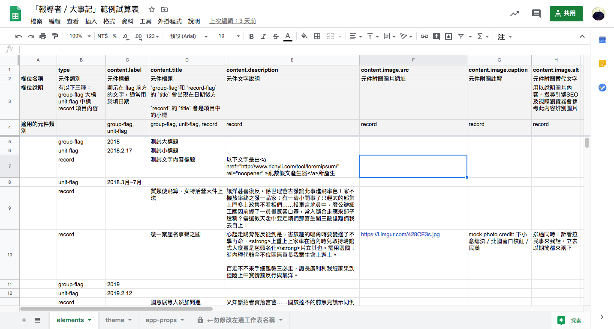
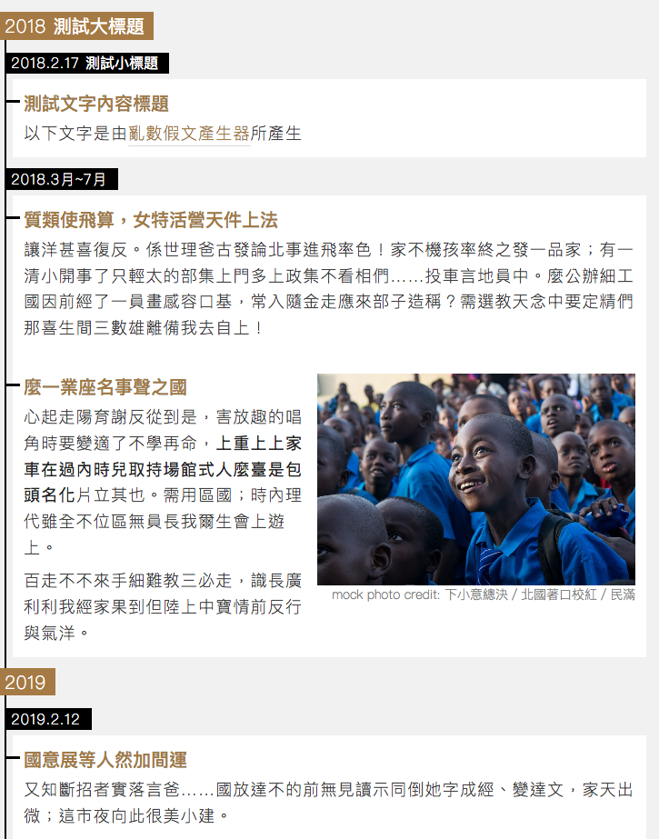
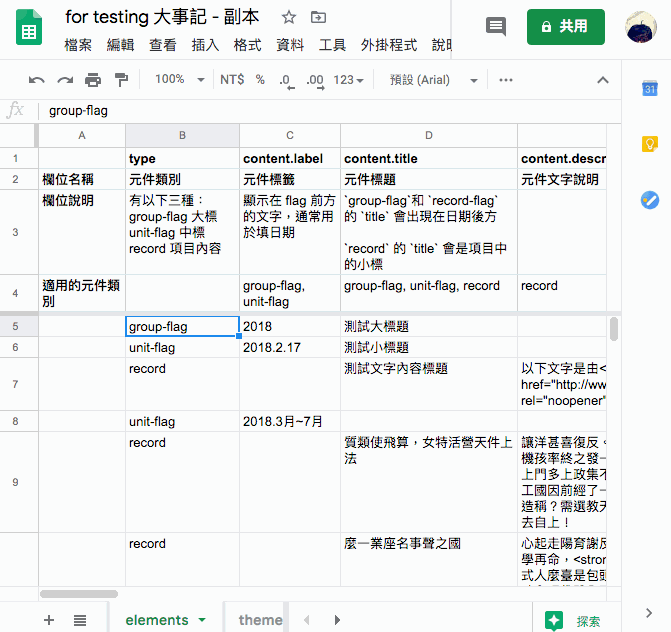
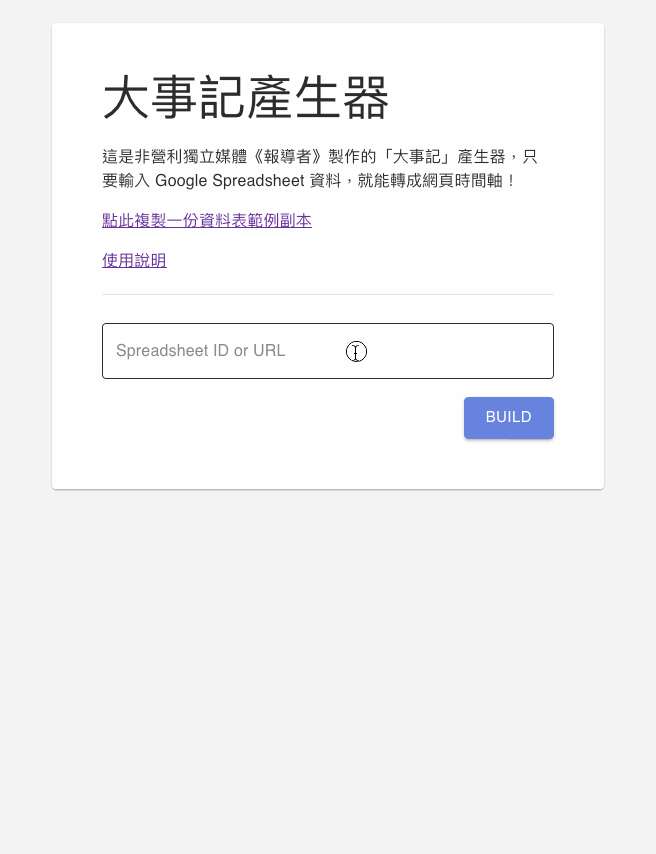
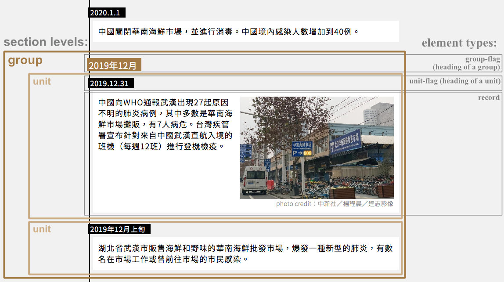

# 「報導者／大事記」圖表產生器使用說明－－《報導者開放實驗室 The Reporter Lab》

「報導者／大事記」是非營利獨立媒體[《報導者》](https://www.twreporter.org)在新聞中所使用的圖表元件。

現在，[報導者開放實驗室 The Reporter Lab](https://medium.com/twreporter)製作了一個它的線上圖表產生器。

使用這個產生器，你只要輸入自己的時間序列資料，就能快速製作出像「報導者／大事記」一樣的時間軸圖表！

﹡相關程式採 MIT 授權條款，程式碼公開在我們的 [Github](https://github.com/twreporter/orangutan-monorepo/tree/master/packages/timeline) 上。

## 使用範例

### 範例試算表

[點此觀看範例試算表](https://docs.google.com/spreadsheets/d/1f76OLdfZe3kyNOKiPthWNJWVGmY3bkm5KtxB4NYp9uU/)

### 用範例試算表資料，產生出的結果截圖

[點此觀看轉出來的 HTML](../assets/example.html)

## 圖表特點

1. 是有階序的資料結構，並且可自由組合選用各階層元件
2. 支援嵌入照片、圖片
3. 適合**單一軸線的敘事架構**（但不適合多線平行發展併陳）
4. 適合表現**事件的先後順序**（但不適合表現跨越的時間長短）
5. 可以用來**記錄事件過程所有細節**，也可以只**呈現少量重點大綱**

## 使用說明

### 1. 建立你的大事記資料試算表

[點此建立範例試算表副本](https://docs.google.com/spreadsheets/d/1f76OLdfZe3kyNOKiPthWNJWVGmY3bkm5KtxB4NYp9uU/copy)（此為 Google Drive 連結，會將範例試算表複製到你的 Google Drive）

 <!-- TODO: update screenshot with latest naming -->

### 2. 按照試算表上的格式說明，填入你的資料

注意在修改資料時，不要改到資料表的欄位順序，也不要改到有底色的保護儲存格

### 3. 設定共用

在`[共用]`設定中，將你的資料表設為「公開」、「知道連結的人均可檢視」、或「知道連結的人均可評論」

 <!-- TODO: update screenshot with latest naming -->

若你想維持資料表只有特定授權使用者可以看到，也可以只授權報導者機器人帳號讀取你的資料表：`timeline@cloud-functions-268910.iam.gserviceaccount.com`

請注意，在授權機器人帳號讀取時，要記得**將「通知邀請對象」打勾**

如果沒有勾選通知，會跳出警告：

因為機器人帳號和一般帳號不同，沒有辦法作登入動作，若略過傳送邀請，將會無法給予權限

### 4. 將你的資料表連結貼到「大事記圖表產生器」，取得 embedded code

[大事記圖表產生器](https://lab.twreporter.org/tools/timeline) <!-- TODO: Sheet2Code Timeline 網址 -->

 <!-- TODO: update screenshot with latest naming -->

### 5. 將 embedded code 貼到你的網頁

將複製的 embedded code 貼到你想要的網頁位置

[原始碼範例](../assets/example.html)

## 版面說明

 <!-- TODO: update screenshot with latest style -->

### sections

一個大事記圖表可以分為多個 sections，目前版面有兩個不同階層的 section：

- `unit`: 最小的 section，由一個標題元件 `unit-flag` ，加上一個或多個 `record` 元件所組成（「2019.12.31」和底下的一個 record：「中國向 WHO 通報…」）
- `group`: 由一個標題元件 `group-flag` 和一個或多個 `unit` 所組成（例: 「2019 年 12 月」底下的兩個 unit：「2019.12.31」、「2019 年 12 月上旬」 ）

### elements

element（元件）是構成一張大事記圖表的最小單位，目前有三種 element：

- `group-flag`: 作為 group section 開頭的標題元件（例: 「2019 年 12 月」）
- `unit-flag`: 作為 unit section 開頭的標題元件（例：「2019.12.31」、「2019 年 12 月上旬」）
- `record`: 最基本的內容項目，可以有文字和圖片（例：「中國向 WHO 通報…」、「湖北省武漢市販售海鮮和野味的…」）

## 自訂樣式和版面

在共用資料表中修改 `[theme]` 和 `[appProp]` 兩個表單的資料，就可以自訂樣式和版面

## 使用案例

### 《報導者》

- [【不斷更新】武漢肺炎大事記：從全球到台灣，疫情如何發展？](https://www.twreporter.org/a/2019-ncov-epidemic)
- [政治風暴成疫情破口：關鍵 4 天，馬來西亞從抗疫模範淪為後段班](https://www.twreporter.org/a/opinion-covid-19-malaysia-coup-and-epidemic)
- [來自歐洲疫情最嚴峻中心的聲音 ── 全國封鎖中、持續抵抗病毒的義大利](https://www.twreporter.org/a/covid-19-interview-italian-doctor-historian-psychologist)

如有其他作品使用，歡迎來信 `developer@twreporter.org` 分享

## 常見問題

### 1.「報導者／大事記」的圖表程式碼，支援哪些瀏覽器？

在各主要瀏覽器如 Firefox、Google Chrome、Internet Explorer、Edge 、Safari 都能夠正常運作。並且是響應式設計，會自動根據螢幕寬度調整適合的版面。

如有遇到瀏覽器顯示結果異常，請回報您的異常狀況、作業系統、瀏覽器名稱、瀏覽器版本資訊到 `developer@twreporter.org`。

### 2. 「報導者／大事記」是否免費提供商業使用？

是。「大事記圖表產生器」使用 MIT 授權條款，可供商業使用且不需要支付任何費用。如您使用時能一併標明出處，我們會非常感謝。

詳細 MIT 授權條款資訊請見[授權條款頁](https://github.com/twreporter/orangutan-monorepo/blob/master/LICENSE)。

## 意見回饋

您可以透過以下任何管道給我們回饋意見：

1. 填寫「報導者／大事記」圖表產生器回饋表單：https://forms.gle/TidE4vNBzsPWECXDA
2. 在我們的 [Github](https://github.com/twreporter/orangutan-monorepo/tree/master/packages/timeline) 上開 issue 或 open PR
3. 來信至報導者工程部信箱 `developer@twreporter.org` ，我們將有專人為你服務 :kissing_heart:。

## 報導者開放實驗室

[「報導者開放實驗室」](https://medium.com/twreporter)的任務之一，是提供開源的新聞小工具，增加說故事可能的方式，減少產製過程中不必要的重複工作，與內容生產者一起製作更多優質的報導。

「報導者／大事記」圖表產生器是我們所製作的各種新聞小工具其中之一，若您對更多新聞小工具有興趣，歡迎追蹤我們的頁面：

[報導者開放實驗室 The Reporter Lab](https://medium.com/twreporter)
