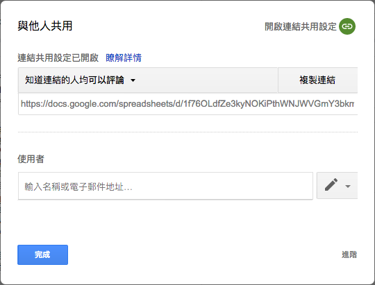
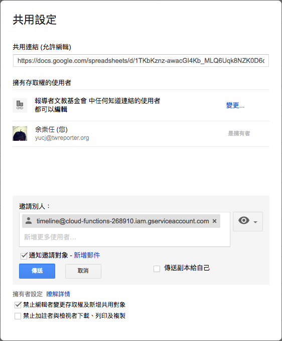

# @twreporter/timeline 使用說明

這是非營利獨立媒體[《報導者》](https://www.twreporter.org)製作的「大事記產生器」，可以幫你把時間序列資料轉換成網頁版大事記！

## 範例

[範例試算表](https://docs.google.com/spreadsheets/d/1f76OLdfZe3kyNOKiPthWNJWVGmY3bkm5KtxB4NYp9uU/)

[範例試算表轉換結果](../assets/example.html)

## 使用說明

### 1. 建立你的大事記資料試算表

- [點此建立範例試算表副本](https://docs.google.com/spreadsheets/d/1f76OLdfZe3kyNOKiPthWNJWVGmY3bkm5KtxB4NYp9uU/copy)
- 按照試算表上的格式說明，填入你的資料。
- 注意在修改資料時，不要改到資料表的欄位順序，和有底色的保護儲存格。

### 2. 設定共用

- 在`[共用]`設定中，將你的資料表設為「公開」、「知道連結的人均可檢視」、或「知道連結的人均可評論」： 
- 若你想維持資料表只有特定授權使用者可以看到，也可以只授權報導者機器人帳號（timeline@cloud-functions-268910.iam.gserviceaccount.com）讀取你的資料表，但要**記得將「通知邀請對象」打勾（重要！沒有勾選寄信通知，機器人無法得到權限）** 

### 3. 將你的資料表連結貼到轉換器，取得 embedded code

[轉換器]() <!-- TODO: Sheet2Code Timeline 網址 -->

### 4. 將 embedded code 貼到你的網頁

將複製的 embedded code 貼到你想要的網頁位置：[原始碼範例](../assets/example.html)

## 版面說明

### elements

element（元件）是組成一張大事記的最小單位，目前有三種 element：

- `group-flag`: group section 開頭的標題元件（例: 「2019 年 12 月」）
- `unit-flag`: unit section 開頭的標題元件（例：「2019.12.31」、「2019 年 12 月上旬」）
- `record`: 最基本的內容項目，可以有文字和圖片（例：「中國向 WHO 通報…」、「湖北省武漢市販售海鮮和野味的…」）

### sections

一個大事記可以分為多個 sections，目前版面有兩個不同階層的 section：

- `unit`: 最小的 section，由一個 unit-flag 和一個或多個 record 組成（「2019.12.31」和底下的一個 record：「中國向 WHO 通報…」）
- `group`: 由一個 group-flag 和一個或多個 unit 組成的 section（例: 「2019 年 12 月」底下的兩個 unit：「2019.12.31」、「2019 年 12 月上旬」 ）

## 自訂樣式和版面

在共用資料表中修改 `[theme]` 和 `[appProp]` 兩個表單的資料，就可以自訂樣式和版面

## 使用案例

### 《報導者》

- [【不斷更新】武漢肺炎大事記：從全球到台灣，疫情如何發展？](https://www.twreporter.org/a/2019-ncov-epidemic)
- [政治風暴成疫情破口：關鍵 4 天，馬來西亞從抗疫模範淪為後段班](https://www.twreporter.org/a/opinion-covid-19-malaysia-coup-and-epidemic)

如有其他作品使用，歡迎來信 `developer@twreporter.org` 分享

## 常見問題

### 1. @twreporter/timeline 支援哪些瀏覽器？

在各主要瀏覽器如 Firefox、Google Chrome、Internet Explorer、Edge 、Safari 都能夠正常運作。並會響應式根據螢幕寬度調整版面。

如有遇到瀏覽器顯示結果異常，請回報您的異常狀況、作業系統、瀏覽器名稱、瀏覽器版本資訊到 `developer@twreporter.org`。

### 2. @twreporter/timeline 是否免費提供商業使用？

是。`@twreporter/timeline` 使用 MIT 授權條款，可供商業使用且不需要支付任何費用，如您使用時能一併標明出處，我們會非常感謝。

詳細授權資訊請見[授權條款頁](https://github.com/twreporter/orangutan-monorepo/blob/master/LICENSE)。

## 回饋

我們將程式碼公開放置於[Github](https://github.com/twreporter/orangutan-monorepo/tree/master/packages/timeline)，任何回饋或問題回報都歡迎直接在 Github 上開 Issue 或來信至 `developer@twreporter.org` 信箱，我們將有專人為你服務 :kissing_heart:。
