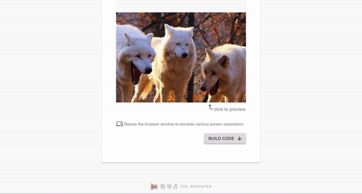

# zoom-in




## What is this

A React Component for zooming images like [Medium](https://medium.com/).

It is built by [The Reporter Taiwan](https://www.twreporter.org) and published as an [npm package](https://www.npmjs.com/package/@twreporter/zoom-in).

Inspired by [medium-zoom](https://github.com/francoischalifour/medium-zoom), except this tool grooves the [React](https://github.com/facebook/react) way.

## How to use this package

### Installation

```sh
yarn add @twreporter/zoom-in
```

or you can use **npm**:

```sh
npm install --save @twreporter/zoom-in
```

### Usage

```jsx
import zoomIn from '@twreporter/zoom-in'
;<zoomIn.Component
  src={imageSrc}
  alt={imageAlt}
  caption={caption}
  theme={customizedTheme}
/>
```

#### Example: [codesandbox example](https://codesandbox.io/s/blue-cdn-wj8zz)

#### Props

| props   | type   | default       | description                                                     |
| ------- | ------ | ------------- | --------------------------------------------------------------- |
| src     | string | ''            | The image link which will be `src` of ``.                  |
| alt     | string | ''            | An alternate text for the image which will be `alt` of ``. |
| caption | string | ''            | A small piece of text that appears around the image.            |
| theme   | object | default theme | See the theme structure and prop types below.                   |

##### theme

```js
{
  /**
   * The container to frame zoomed image.
   */
  frame: {
    /**
     * Frame size in pixels
     */
    width: PropTypes.number,
    height: PropTypes.number,
    /**
     * Distances from viewport in pixels.
     */
    top: PropTypes.number,
    bottom: PropTypes.number,
    left: PropTypes.number,
    right: PropTypes.number,
  },
  /**
   * Overlay fills the entire area of the frame,
   * where the zoomed image is presented on top of it.
   */
  overlay: {
    background: PropTypes.string,
    opacity: PropTypes.number,
    zIndex: PropTypes.number,
  },
  /**
   * The zoomed image margins relative to frame.
   */
  image: {
    marginTop: PropTypes.number,
    marginBottom: PropTypes.number,
    marginLeft: PropTypes.number,
    marginRight: PropTypes.number,
  },
  /**
   * Caption is a small piece of text that appears around the image.
   */
  caption: {
    /**
     * The place outside the caption around the zoomed image.
     */
    marginTop: PropTypes.number,
    marginBottom: PropTypes.number,
    marginLeft: PropTypes.number,
    marginRight: PropTypes.number,
    /**
     * The font style of caption around the zoomed image.
     */
    fontSize: PropTypes.number,
    lineHeight: PropTypes.number,
    letterSpacing: PropTypes.number,
    color: '#000',
    fontFamily: PropTypes.string,
    /**
     * To show caption beneath the original image or not.
     */
    showCaptionWhenZoomOut: PropTypes.bool,
  },
  zoomOptions: {
    /**
     * The transition duration for zoom in/out animation.
     */
    transitionDuration: PropTypes.number,
    /**
     * The transition function for zoom in/out animation.
     */
    transitionFunction: PropTypes.string,
    /**
     * The number of pixels to scroll to zoom out.
     */
    scrollOffset: PropTypes.number,
  }
}
```

default theme

```js
{
  frame: {
    width: document.documentElement.clientWidth
    height: document.documentElement.clientHeight
    top: 0,
    bottom: 0,
    left: 0,
    right: 0,
  },
  overlay: {
    background: '#fff',
    opacity: 1,
    zIndex: 1,
  },
  image: {
    marginTop: 0,
    marginLeft: 0,
    marginRight: 0,
    marginBottom: 0,
  },
  caption: {
    marginLeft: 0,
    marginRight: 0,
    marginTop: 0,
    marginBottom: 0,
    fontSize: 12,
    lineHeight: 18,
    letterSpacing: 0.34,
    color: '#000',
    fontFamily: '',
    showCaptionWhenZoomOut: false,
  },
  zoomOptions: {
    transitionDuration: 300,
    transitionFunction: 'cubic-bezier(0.2, 0, 0.2, 1)',
    scrollOffset: 30,
  }
}
```

#### Build Embedded Code

You might want to build embedded code and make it embed in `<body>` element of a HTML document.

```jsx
import zoomIn from '@twreporter/zoom-In'
import zoomInWebpackAssets from '@twreporter/zoom-in/dist/webpack-assets.json'

// mock data
mock: {
  src: 'https://i.imgur.com/gezB3it.jpg',
  alt: 'this is alternative text',
  caption: 'this is the caption'
}

const embeddedCode = zoomIn.buildEmbeddedCode(
  {
    data: mock
  },
  zoomInWebpackAssets
)
```

## How to develop this package

1. We use `webpack-dev-server` to render a mock data for development.

   ```sh
   # Start the webpack-dev-server
   make dev-server
   ```

2. Or use `babel --watch` to complie the source file if there's any change happened

   ```sh
   make dev
   ```

3. If you need to update the embedded code, there is an embedded code testing server serves a html document with injected embedded code

```sh
# Build testing embedded code and start express server to test it
make test-embedded-code
```

## How to publish this package

```sh
# Babel transpile es6 and above to es5 at lib/
# Build webpack bundles, chunks and webpack-assets.json to dist/
# Files in lib/ and dist/ folders will be published to npm

make build
```

```sh
yarn publish
# OR
npm publish
```

## Credits

Thanks to the creator of [medium-zoom](https://github.com/francoischalifour/medium-zoom) library which is written by [François Chalifour](https://francoischalifour.com/).

Credit to [Gina](https://www.twreporter.org/author/5a0d4eb109e8eb7a03e3145c) for designing this component, [taylrj](https://github.com/taylrj) and [nicksine](https://github.com/nickhsine) for developing it.

## License

This project is released under the [MIT license](../../LICENSE)
