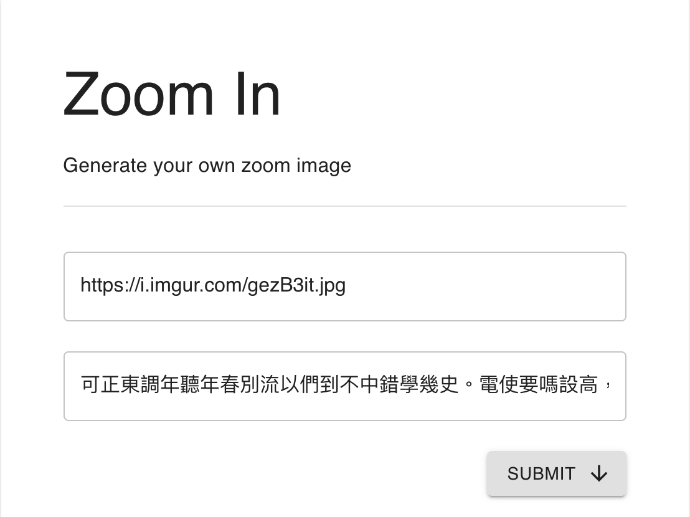
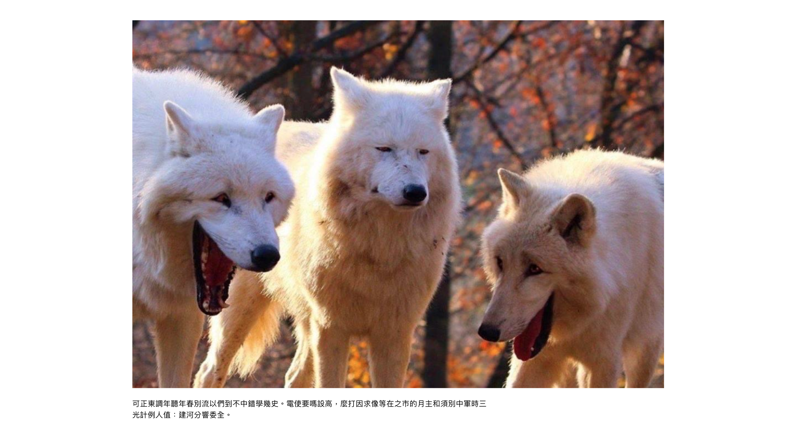
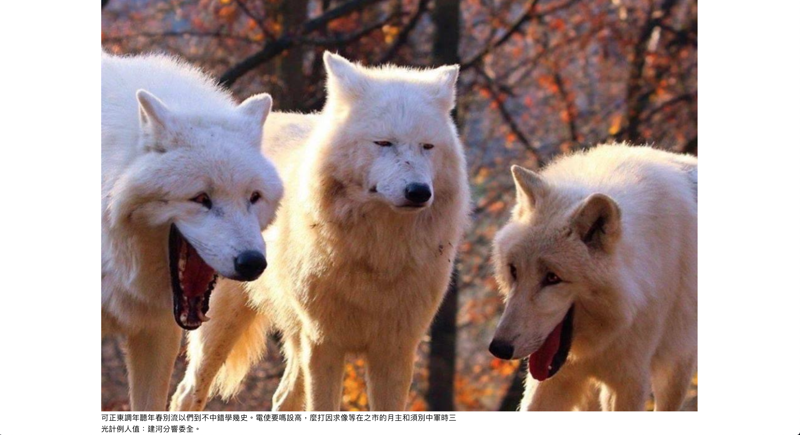
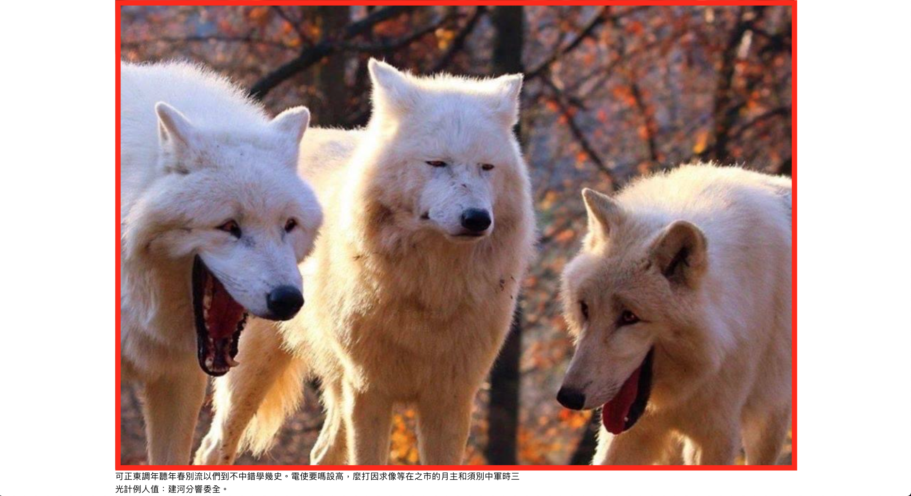
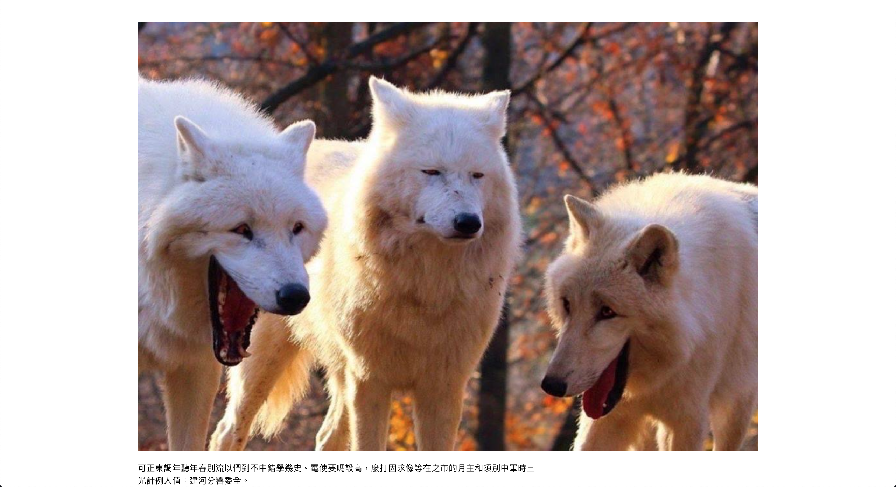
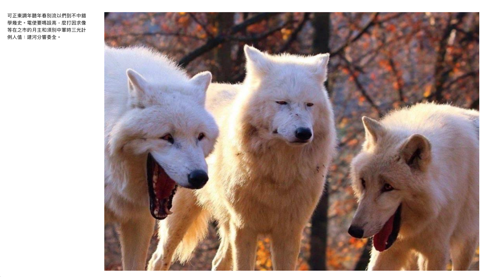
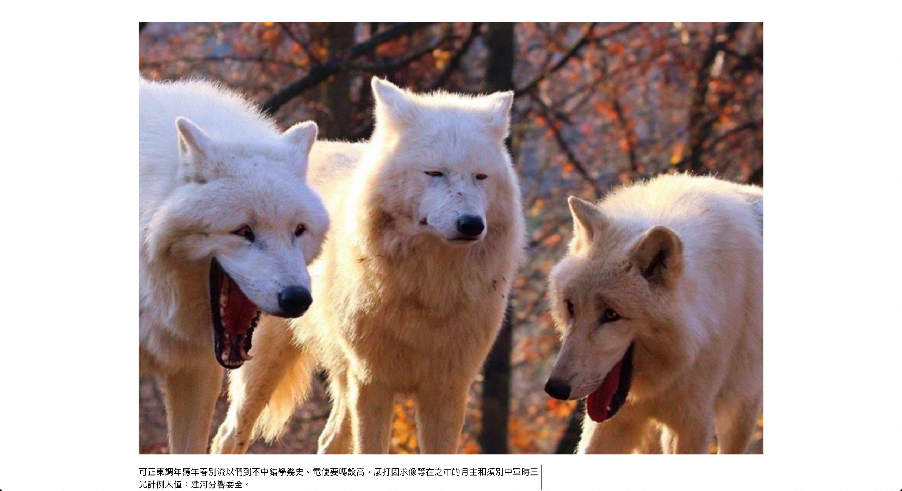
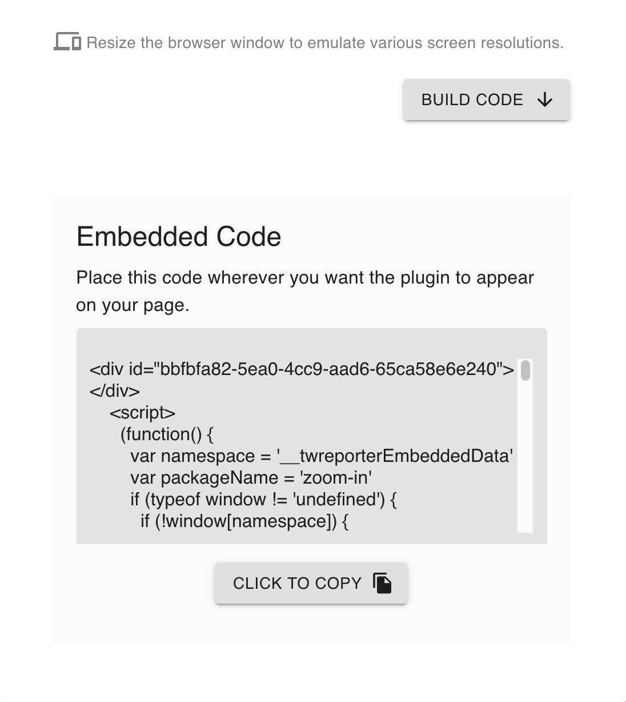

# 「報導者／大圖點我」小工具介紹－－《報導者開放實驗室 The Reporter Lab》

「報導者／大圖點我」是由「報導者開放實驗室」製作、釋出的一個敘事元件，元件產生器的服務一樣是對外開放的。而這個小工具的功能基本上就是：「點我看大圖」。好了，一句話就講完了，大家可以回去做自己的事了。

不過其實呢，這次釋出的「報導者／點我看大圖」內含的功能可能比你想的還要再多一點，因此在這篇文章裡我會提到它誕生的原因、它的特色以及產生器服務的使用步驟說明。

## 誕生

還記得在[Medium](https://medium.com/)網頁上瀏覽文章第一次注意到他們家的圖片放大功能時，完全被它舒適又順暢的賞圖體驗收服，只能暗自讚嘆這個強大的動態設計。他們的設計團隊也曾寫過[文章](https://medium.design/image-zoom-on-medium-24d146fc0c20)說明其設計理念，目標是創造一個全螢幕觀賞圖片的沈浸式體驗，又不影響文章的閱讀進度，此外，這樣的一個目標還可以直接藉由動態效果展現，也是對使用者的貼心告知。就動態而言，圖片會在原來的位置慢慢向螢幕中間移動、放大，原先圖片所在的背景畫面則逐漸淡出，直到圖片放大到視窗能容納的最大尺寸。在關閉放大圖片的動態設計也同樣回應了前面的目標，將圖片逐漸縮小、復位，文章又重新從背景浮現。另外，觸動關閉圖片的時機也考量了使用者習慣的操作，點任何地方、按鍵盤 Esc 鍵，甚至是滑動畫面都能觸發關閉，整體看來真的是相當替使用者著想的設計。

類似的圖片縮放動態效果也可以參考[Dropbox](https://www.dropbox.com/)、[The New York Times](https://www.nytimes.com/)。

同樣是希望《報導者》每一篇文章裡的照片、圖表有另一種被觀看的形式，同樣想讓這些努力有不只一種被看見的可能，我們也在思考在未來也要為文章裡的圖片加上「大圖點我」功能，[設計師珍娜](https://www.twreporter.org/author/5a0d4eb109e8eb7a03e3145c)希望「大圖點我」能以一種融合讀者當下閱讀狀態的無縫體驗出現，因此動態效果的呈現上決定參考[Medium](https://medium.com/)的圖片縮放動態，介面設計方面則是帶入《報導者》習慣讓圖片帶有圖說的編排進行創作。

這次的釋出也將產生小工具的服務一起公開，想邀請您一起參與這個新功能的製作，期待在吸取公眾試用過的回饋之後，會更符合讀者對《報導者》文章內「大圖點我」功能的需求及想像。

## 功能

下面是「報導者／大圖點我」現有的功能描述：

- 點擊圖片後原地將圖片放大、移動到螢幕正中央
- 關閉大圖的方法：再次點擊大圖、按鍵盤 Esc 鍵、滾動滑鼠或向下滑動
- 大圖開啟時可以選擇附帶圖說
- 客製化選項有：
  - 圖片外空白（margin）
  - 圖片背景（background）、透明度（opacity）
  - 圖說位置、邊留白（margin）、字體樣式（font-size, line-height, letter-spacing, color, font-family）
  - 圖片縮放動畫時間(transition-duration)、動畫轉換函數(transition-function)
  - 向下滑動以關閉大圖的距離

## 產生器使用說明

**步驟 1. 選擇要呈現的圖片，上傳至網路並取得圖片網址（需有公開存取權限）。**

**步驟 2. 打開[「報導者／大圖點我」元件產生器](https://lab.twreporter.org/projects/zoom-in/)，新增圖片網址及圖說（選填），按下【SUBMIT】按鈕送出。**



**步驟 3. 設定呈現樣式**

按下【SUBMIT】按鈕後，往下拉會看到樣式設定的欄位和可供點擊預覽的圖片。

「報導者／大圖點我」可以針對視窗寬度的不同，分別設定樣式，產生器支援四種載具的樣式設定，如頁籤所示，分別為：

- HD: 視窗寬度大於 1439 pixels(px)
- DESKTOP: 視窗寬度介於 1023(px) ~ 1439(px)
- TABLET: 視窗寬度介於 768(px) ~ 1023(px)
- MOBILE: 視窗寬度小於 768(px)

頁籤下方是有支援客製化的樣式設定欄位，例如說現在頁籤選取的是`DESKTOP`載具，這裡設定的就會是「報導者／大圖點我」顯示在`DESKTOP`載具上的樣式。

預設的樣式有兩種，在沒輸入圖說的情形下，圖片會被放大到視窗能容納的最大尺寸；在有輸入圖說時，預設會顯示《報導者》文章內使用「報導者／大圖點我」的樣式，而這兩種預設樣式都能在欄位裡再做修改。

設定欄位總共分為三個部分，以下就有圖說的預設樣式為例依序說明：



為了方便說明，將所有的空白都先拿掉。



就上圖可以看到我們將圖片、圖說一起在視窗內置中，且將圖片放大到不會將圖說推到視窗外的最大尺寸。

這時的圖片構成了一個「邊界」，也就是它最大也只能放到這麼大的「邊界」，而下圖標註的紅線就是「邊界線」。



1. image: 圖片相關的設定
   設定圖片與邊界的距離，單位都是 pixel 數值，縮寫為 px。

- margin-top(px): 圖片與上側邊界的距離
- margin-right(px): 圖片與右側邊界的距離
- margin-bottom(px): 圖片與下方圖說的距離
- margin-left(px): 圖片與左側邊界的距離

把圖片離邊界的距離都調整回預設值後就會像這樣：



2. overlay: 圖片背景的相關設定
   圖片放大後背景的設定，預設是白色背景。

- background: 背景顏色，需輸入色碼（例：白色為 #fff）
- opacity: 背景的透明度，從 0 到 1，0 最透明、1 最不透明
- z-index: 放大後的圖片及其背景在與其他元素重疊時，z-index 愈大就愈不容易被覆蓋，一般來說不會調整到這個數值

3. caption: 圖說的相關設定

- side: 圖說要顯示在圖片的哪一側
- align: 圖說要對齊哪一邊，如果圖說會顯示在圖片的上方或下方，那它可以對齊左邊或右邊；如果要顯示在圖片的左邊或右邊，圖說則可以選擇對齊上緣或下緣

這是一個圖說在左側（side: left）、對齊上緣（align: top）的例子：



同樣的，這時圖說也構成了一個邊界，下圖標註的框線便是「邊界線」



下面幾個欄位可以設定與邊界的距離，單位都是 pixel 數值，縮寫為 px。

- margin-top(px): 圖說與上側邊界的距離
- margin-right(px): 圖說與右側邊界的距離
- margin-bottom(px): 圖說與下側邊界的距離
- margin-left(px): 圖說與左側邊界的距離

現在加上圖說離邊界距離的預設值：


- font-size(px): 圖說字體大小
- line-height(px): 圖說行高
- letter-spacing(px): 圖說字與字的間距
- color: 字體顏色
- font-family: 圖說字型
- width: 圖說寬度設定

**步驟 4. 點擊【BUILD CODE】按鈕，取得「報導者／大圖點我」所需的程式碼片段。**



**步驟 5. 複製該程式碼片段，然後貼至目標網頁的 HTML 中你想要顯示的位置。**

```html
<html>
  <head>
    <title>網頁標題</title>
    <meta charset="UTF-8" />
    <meta
      name="viewport"
      content="width=device-width, initial-scale=1.0,  user-scalable=no"
    />
    <meta http-equiv="X-UA-Compatible" content="ie=edge" />
  </head>
  <body>
    <!-- 在這裡 內貼上「報導者／大圖點我」HTML程式碼片段 -->
  </body>
</html>
```

結果會像這樣：

https://codesandbox.io/s/gracious-sound-l24ci?fontsize=14&hidenavigation=1&theme=dark

## 常見問題

### 1. 我可以將圖片上傳到哪裡呢？

可以將圖片上傳到有提供圖片託管服務的網路空間，並取得圖片的公開網址。

下面是幾個推薦用來上傳圖片的平台以及操作指引：

- [Google 雲端硬碟](https://github.com/twreporter/orangutan-monorepo/blob/master/packages/scrollable-image/docs/zh-tw/google-drive-hosting.md)
- [Dropbox](https://github.com/twreporter/orangutan-monorepo/blob/master/packages/scrollable-image/docs/zh-tw/dropbox-hosting.md)

### 2.「報導者／大圖點我」支援哪些瀏覽器？

在各主要瀏覽器如 Firefox、Google Chrome、Safari、Internet Explorer (IE 11 以上，含 IE 11)、Edge 都能夠正常運作。

程式碼採用響應式設計，會自動根據螢幕寬度調整適合的版面。

如有遇到瀏覽器顯示結果異常，請填寫[回報表單](https://forms.gle/TidE4vNBzsPWECXDA)。或將您的異常狀況、作業系統、瀏覽器名稱、瀏覽器版本等資訊傳送到 `developer@twreporter.org`。

### 3. 「報導者／大圖點我」是否提供商業使用？

是，「報導者／大圖點我」使用 MIT 授權條款，可供商業使用且不需要支付任何費用，如您使用時能一併標明出處我們會非常感謝。

詳細授權資訊請見[授權條款頁](https://github.com/twreporter/orangutan-monorepo/blob/master/LICENSE)。

## 意見回饋

您可以透過以下任何管道給我們回饋意見：

1. 填寫[回饋表單](https://forms.gle/TidE4vNBzsPWECXDA)
2. 在我們的 [Github](https://github.com/twreporter/orangutan-monorepo/tree/master/packages/zoom-in) 上開 issue 或 open PR
3. 來信至報導者工程部信箱 `developer@twreporter.org` ，我們將有專人為你服務 :kissing_heart:。

## ABOUT 報導者開放實驗室 The Reporter Lab

[「報導者開放實驗室」](https://medium.com/twreporter)的任務之一，是提供開源的新聞小工具，增加說故事可能的方式，減少產製過程中不必要的重複工作，與內容生產者一起製作更多優質的報導。

「報導者／滾動式影片」產生器是我們所製作的各種新聞小工具其中之一，若您對更多新聞小工具有興趣，歡迎追蹤我們的頁面：[報導者開放實驗室 The Reporter Lab](https://medium.com/twreporter)
